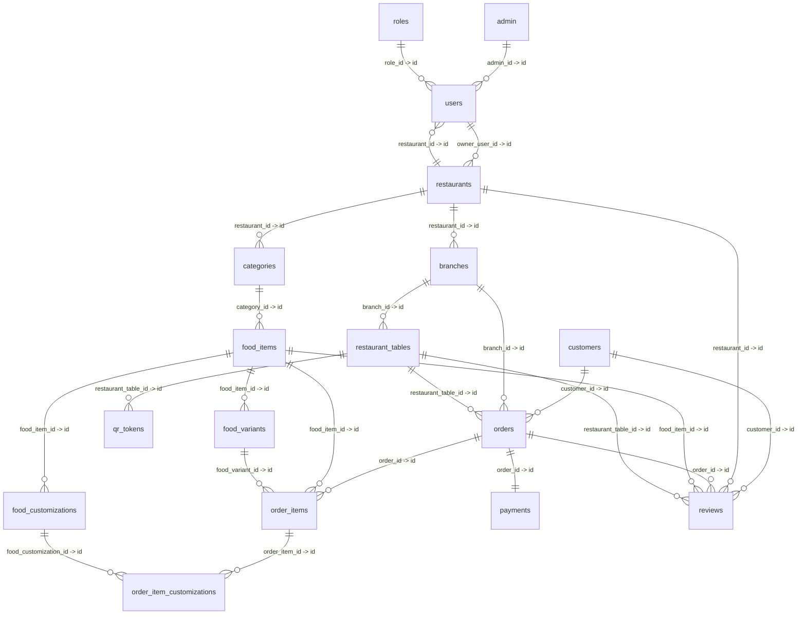

# Complete Relational Database Design: Healthy Bite (17 Tables)

This document provides the complete, authoritative technical database design for the **17 approved tables** of **Healthy Bite – Digital Menu & Food Ordering System**.

---

## 1. System Architecture & Entity Overview

---

## 2. Exhaustive Table Specifications

### 1. `admin`
- **Purpose**: System administration and platform management master entity.
- **Primary Key**: `id`
- **Foreign Keys**: None

| Attribute | Data Type | Nullability | Constraints / Keys | Default Value | Description / Business Rule |
| :--- | :--- | :--- | :--- | :--- | :--- |
| `id` | `BIGINT UNSIGNED` | `NOT NULL` | `PRIMARY KEY`, `AUTO_INCREMENT` | Auto | Unique administration entity ID |
| `name` | `VARCHAR(120)` | `NOT NULL` | - | None | Admin group name (e.g., 'Platform Super Admin') |
| `created_at` | `TIMESTAMP` | `NOT NULL` | - | `CURRENT_TIMESTAMP` | Record creation timestamp |
| `updated_at` | `TIMESTAMP` | `NOT NULL` | - | `CURRENT_TIMESTAMP ON UPDATE CURRENT_TIMESTAMP` | Last update timestamp |

- **Relationships**:
  - `admin (1) -> users (N)`: **One-to-Many (1:N)**. An admin platform level can associate with multiple user accounts.

---

### 2. `roles`
- **Purpose**: Master lookup table for role-based access control (RBAC), defining operational privileges (`super_admin`, `owner`, `manager`, `staff`).
- **Primary Key**: `id`
- **Foreign Keys**: None

| Attribute | Data Type | Nullability | Constraints / Keys | Default Value | Description / Business Rule |
| :--- | :--- | :--- | :--- | :--- | :--- |
| `id` | `BIGINT UNSIGNED` | `NOT NULL` | `PRIMARY KEY`, `AUTO_INCREMENT` | Auto | Unique role identifier |
| `name` | `VARCHAR(80)` | `NOT NULL` | - | None | Display name of role (e.g. 'Restaurant Owner') |
| `slug` | `VARCHAR(50)` | `NOT NULL` | `UNIQUE` | None | Machine slug (`super_admin`, `owner`, `manager`, `staff`) |
| `description` | `VARCHAR(255)` | `NULL` | - | `NULL` | Explanation of role permissions |
| `created_at` | `TIMESTAMP` | `NOT NULL` | - | `CURRENT_TIMESTAMP` | Record creation timestamp |
| `updated_at` | `TIMESTAMP` | `NOT NULL` | - | `CURRENT_TIMESTAMP ON UPDATE CURRENT_TIMESTAMP` | Last update timestamp |

- **Relationships**:
  - `roles (1) -> users (N)`: **One-to-Many (1:N)**. Each role is assigned to multiple user accounts; each user belongs to exactly one role.

---

### 3. `users`
- **Purpose**: Identity and authentication records for super administrators, restaurant owners, branch managers, and kitchen/floor staff.
- **Primary Key**: `id`
- **Foreign Keys**:
  - `admin_id` -> `admin.id` (`ON UPDATE CASCADE ON DELETE SET NULL`)
  - `role_id` -> `roles.id` (`ON UPDATE CASCADE ON DELETE RESTRICT`)
  - `restaurant_id` -> `restaurants.id` (`ON UPDATE CASCADE ON DELETE SET NULL`)

| Attribute | Data Type | Nullability | Constraints / Keys | Default Value | Description / Business Rule |
| :--- | :--- | :--- | :--- | :--- | :--- |
| `id` | `BIGINT UNSIGNED` | `NOT NULL` | `PRIMARY KEY`, `AUTO_INCREMENT` | Auto | Unique user account ID |
| `admin_id` | `BIGINT UNSIGNED` | `NULL` | `FK`, `INDEX` | `NULL` | Platform admin reference |
| `role_id` | `BIGINT UNSIGNED` | `NULL` | `FK`, `INDEX` | `NULL` | Assigned role reference |
| `restaurant_id` | `BIGINT UNSIGNED` | `NULL` | `FK`, `INDEX` | `NULL` | Scoped restaurant tenant (NULL for superadmins) |
| `name` | `VARCHAR(120)` | `NOT NULL` | - | None | Full legal or display name |
| `email` | `VARCHAR(190)` | `NOT NULL` | `UNIQUE` | None | Unique login email (case-insensitive in validation) |
| `password_hash` | `VARCHAR(255)` | `NOT NULL` | - | None | BCrypt secure hashed password |
| `status` | `ENUM('active', 'inactive')` | `NOT NULL` | - | `'active'` | Account activation state |
| `created_at` | `TIMESTAMP` | `NOT NULL` | - | `CURRENT_TIMESTAMP` | Registration timestamp |
| `updated_at` | `TIMESTAMP` | `NOT NULL` | - | `CURRENT_TIMESTAMP ON UPDATE CURRENT_TIMESTAMP` | Last profile update timestamp |

- **Relationships**:
  - `roles (1) -> users (N)`: **Many-to-One (N:1)**.
  - `admin (1) -> users (N)`: **Many-to-One (N:1)**.
  - `restaurants (1) -> users (N)`: **Many-to-One (N:1)** (Employment scope).
  - `users (1) -> restaurants (N)`: **One-to-Many (1:N)** (via `restaurants.owner_user_id`).

---

### 4. `restaurants`
- **Purpose**: Restaurant tenant master profile storing legal business identity, branding, contact details, and platform approval status.
- **Primary Key**: `id`
- **Foreign Keys**:
  - `owner_user_id` -> `users.id` (`ON UPDATE CASCADE ON DELETE SET NULL`)

| Attribute | Data Type | Nullability | Constraints / Keys | Default Value | Description / Business Rule |
| :--- | :--- | :--- | :--- | :--- | :--- |
| `id` | `BIGINT UNSIGNED` | `NOT NULL` | `PRIMARY KEY`, `AUTO_INCREMENT` | Auto | Unique tenant identifier |
| `owner_user_id` | `BIGINT UNSIGNED` | `NULL` | `FK`, `INDEX` | `NULL` | Primary owner account ID |
| `name` | `VARCHAR(160)` | `NOT NULL` | - | None | Registered restaurant name |
| `email` | `VARCHAR(190)` | `NULL` | - | `NULL` | Business contact email |
| `phone` | `VARCHAR(30)` | `NULL` | - | `NULL` | Business contact phone number |
| `address` | `VARCHAR(500)` | `NULL` | - | `NULL` | Head office / main street address |
| `city` | `VARCHAR(120)` | `NULL` | - | `NULL` | City |
| `state` | `VARCHAR(120)` | `NULL` | - | `NULL` | State / Region |
| `cuisine_type` | `VARCHAR(120)` | `NULL` | - | `NULL` | Type of cuisine (e.g. 'Organic & Healthy') |
| `description` | `VARCHAR(1000)` | `NULL` | - | `NULL` | Public restaurant bio / summary |
| `approval_status` | `ENUM('pending', 'approved', 'suspended')` | `NOT NULL` | - | `'approved'` | Platform approval status |
| `created_at` | `TIMESTAMP` | `NOT NULL` | - | `CURRENT_TIMESTAMP` | Registration timestamp |
| `updated_at` | `TIMESTAMP` | `NOT NULL` | - | `CURRENT_TIMESTAMP ON UPDATE CURRENT_TIMESTAMP` | Last profile update timestamp |

- **Relationships**:
  - `users (1) -> restaurants (N)`: **Many-to-One (N:1)**.
  - `restaurants (1) -> users (N)`: **One-to-Many (1:N)**.
  - `restaurants (1) -> branches (N)`: **One-to-Many (1:N)**.
  - `restaurants (1) -> categories (N)`: **One-to-Many (1:N)**.
  - `restaurants (1) -> reviews (N)`: **One-to-Many (1:N)**.

---

### 5. `branches`
- **Purpose**: Physical locations / outlets operated by a restaurant tenant.
- **Primary Key**: `id`
- **Foreign Keys**:
  - `restaurant_id` -> `restaurants.id` (`ON UPDATE CASCADE ON DELETE CASCADE`)

| Attribute | Data Type | Nullability | Constraints / Keys | Default Value | Description / Business Rule |
| :--- | :--- | :--- | :--- | :--- | :--- |
| `id` | `BIGINT UNSIGNED` | `NOT NULL` | `PRIMARY KEY`, `AUTO_INCREMENT` | Auto | Unique branch identifier |
| `restaurant_id` | `BIGINT UNSIGNED` | `NOT NULL` | `FK`, `INDEX` | None | Parent restaurant tenant ID |
| `name` | `VARCHAR(160)` | `NOT NULL` | - | None | Branch outlet label (e.g. 'Downtown Main Branch') |
| `phone` | `VARCHAR(30)` | `NULL` | - | `NULL` | Branch direct phone |
| `address` | `VARCHAR(500)` | `NULL` | - | `NULL` | Physical location address |
| `created_at` | `TIMESTAMP` | `NOT NULL` | - | `CURRENT_TIMESTAMP` | Creation timestamp |
| `updated_at` | `TIMESTAMP` | `NOT NULL` | - | `CURRENT_TIMESTAMP ON UPDATE CURRENT_TIMESTAMP` | Last modification timestamp |

- **Relationships**:
  - `restaurants (1) -> branches (N)`: **Many-to-One (N:1)**.
  - `branches (1) -> restaurant_tables (N)`: **One-to-Many (1:N)**.
  - `branches (1) -> orders (N)`: **One-to-Many (1:N)**.

---

### 6. `categories`
- **Purpose**: Menu category groupings (e.g. Salads & Greens, Fresh Smoothies, Mains) used to organize food items.
- **Primary Key**: `id`
- **Foreign Keys**:
  - `restaurant_id` -> `restaurants.id` (`ON UPDATE CASCADE ON DELETE CASCADE`)

| Attribute | Data Type | Nullability | Constraints / Keys | Default Value | Description / Business Rule |
| :--- | :--- | :--- | :--- | :--- | :--- |
| `id` | `BIGINT UNSIGNED` | `NOT NULL` | `PRIMARY KEY`, `AUTO_INCREMENT` | Auto | Unique category ID |
| `restaurant_id` | `BIGINT UNSIGNED` | `NOT NULL` | `FK`, `INDEX` | None | Restaurant tenant owner |
| `name` | `VARCHAR(120)` | `NOT NULL` | `UNIQUE(restaurant_id, name)` | None | Category display name |
| `sort_order` | `INT UNSIGNED` | `NOT NULL` | - | `0` | Sequence order for menu display |
| `is_active` | `TINYINT(1)` | `NOT NULL` | - | `1` | Visibility toggle (1=visible, 0=hidden) |
| `created_at` | `TIMESTAMP` | `NOT NULL` | - | `CURRENT_TIMESTAMP` | Creation timestamp |
| `updated_at` | `TIMESTAMP` | `NOT NULL` | - | `CURRENT_TIMESTAMP ON UPDATE CURRENT_TIMESTAMP` | Last modification timestamp |

- **Relationships**:
  - `restaurants (1) -> categories (N)`: **Many-to-One (N:1)**.
  - `categories (1) -> food_items (N)`: **One-to-Many (1:N)**.

---

### 7. `food_items`
- **Purpose**: Dish catalog storing pricing, detailed nutritional breakdown (calories, protein, carbs, fat, fiber, sugar), allergen notices, dietary flags, and availability.
- **Primary Key**: `id`
- **Foreign Keys**:
  - `category_id` -> `categories.id` (`ON UPDATE CASCADE ON DELETE RESTRICT`)

| Attribute | Data Type | Nullability | Constraints / Keys | Default Value | Description / Business Rule |
| :--- | :--- | :--- | :--- | :--- | :--- |
| `id` | `BIGINT UNSIGNED` | `NOT NULL` | `PRIMARY KEY`, `AUTO_INCREMENT` | Auto | Unique dish ID |
| `category_id` | `BIGINT UNSIGNED` | `NOT NULL` | `FK`, `INDEX` | None | Menu category reference |
| `name` | `VARCHAR(160)` | `NOT NULL` | - | None | Dish name |
| `description` | `VARCHAR(1000)` | `NULL` | - | `NULL` | Culinary description of the item |
| `image` | `VARCHAR(255)` | `NULL` | - | `NULL` | Image asset URL or file path |
| `ingredients` | `TEXT` | `NULL` | - | `NULL` | Comma-separated or text ingredients |
| `base_price` | `DECIMAL(10,2)` | `NOT NULL` | - | None | Base selling price (excluding add-ons) |
| `calories` | `INT` | `NULL` | - | `NULL` | Calories (kcal) |
| `protein` | `DECIMAL(8,2)` | `NULL` | - | `NULL` | Protein content (grams) |
| `carbs` | `DECIMAL(8,2)` | `NULL` | - | `NULL` | Carbohydrates content (grams) |
| `fat` | `DECIMAL(8,2)` | `NULL` | - | `NULL` | Fat content (grams) |
| `fiber_g` | `DECIMAL(8,2)` | `NULL` | - | `NULL` | Dietary fiber content (grams) |
| `sugar_g` | `DECIMAL(8,2)` | `NULL` | - | `NULL` | Sugar content (grams) |
| `allergens` | `VARCHAR(255)` | `NULL` | - | `NULL` | Known allergens (e.g. 'Nuts, Dairy') |
| `preparation_time`| `INT` | `NULL` | - | `NULL` | Estimated prep duration (minutes) |
| `spice_level` | `VARCHAR(50)` | `NULL` | - | `'medium'` | 'low', 'medium', 'high', 'extra_spicy' |
| `food_type` | `VARCHAR(50)` | `NOT NULL` | - | `'veg'` | 'veg', 'non_veg', 'vegan', 'jain' |
| `serving_size` | `VARCHAR(80)` | `NULL` | - | `NULL` | e.g. '350g', '1 bowl', '250ml' |
| `is_available` | `TINYINT(1)` | `NOT NULL` | - | `1` | 1=in stock, 0=out of stock |
| `is_featured` | `TINYINT(1)` | `NOT NULL` | - | `0` | 1=chef recommendation/featured |
| `created_at` | `TIMESTAMP` | `NOT NULL` | - | `CURRENT_TIMESTAMP` | Creation timestamp |
| `updated_at` | `TIMESTAMP` | `NOT NULL` | - | `CURRENT_TIMESTAMP ON UPDATE CURRENT_TIMESTAMP` | Last modification timestamp |

- **Relationships**:
  - `categories (1) -> food_items (N)`: **Many-to-One (N:1)**.
  - `food_items (1) -> food_variants (N)`: **One-to-Many (1:N)**.
  - `food_items (1) -> food_customizations (N)`: **One-to-Many (1:N)**.
  - `food_items (1) -> order_items (N)`: **One-to-Many (1:N)**.
  - `food_items (1) -> reviews (N)`: **One-to-Many (1:N)**.

---

### 8. `food_variants`
- **Purpose**: Size and portion modifiers for a dish (e.g., Regular, Large Bowl) with additive price adjustments.
- **Primary Key**: `id`
- **Foreign Keys**:
  - `food_item_id` -> `food_items.id` (`ON UPDATE CASCADE ON DELETE CASCADE`)

| Attribute | Data Type | Nullability | Constraints / Keys | Default Value | Description / Business Rule |
| :--- | :--- | :--- | :--- | :--- | :--- |
| `id` | `BIGINT UNSIGNED` | `NOT NULL` | `PRIMARY KEY`, `AUTO_INCREMENT` | Auto | Unique variant ID |
| `food_item_id` | `BIGINT UNSIGNED` | `NOT NULL` | `FK`, `INDEX` | None | Parent dish ID |
| `name` | `VARCHAR(80)` | `NOT NULL` | - | None | Variant name (e.g. 'Large Bowl') |
| `price_adjustment`| `DECIMAL(10,2)`| `NOT NULL` | - | `0.00` | Differential price adjustment (e.g. +3.50) |
| `created_at` | `TIMESTAMP` | `NOT NULL` | - | `CURRENT_TIMESTAMP` | Creation timestamp |
| `updated_at` | `TIMESTAMP` | `NOT NULL` | - | `CURRENT_TIMESTAMP ON UPDATE CURRENT_TIMESTAMP` | Last modification timestamp |

- **Relationships**:
  - `food_items (1) -> food_variants (N)`: **Many-to-One (N:1)**.
  - `food_variants (1) -> order_items (N)`: **One-to-Many (1:N)**.

---

### 9. `food_customizations`
- **Purpose**: Optional dish add-ons and ingredient extras (e.g., Extra Avocado, Feta Cheese) with individual price adjustments.
- **Primary Key**: `id`
- **Foreign Keys**:
  - `food_item_id` -> `food_items.id` (`ON UPDATE CASCADE ON DELETE CASCADE`)

| Attribute | Data Type | Nullability | Constraints / Keys | Default Value | Description / Business Rule |
| :--- | :--- | :--- | :--- | :--- | :--- |
| `id` | `BIGINT UNSIGNED` | `NOT NULL` | `PRIMARY KEY`, `AUTO_INCREMENT` | Auto | Unique customization ID |
| `food_item_id` | `BIGINT UNSIGNED` | `NOT NULL` | `FK`, `INDEX` | None | Parent dish ID |
| `name` | `VARCHAR(120)` | `NOT NULL` | - | None | Add-on name (e.g. 'Extra Avocado') |
| `price_adjustment`| `DECIMAL(10,2)`| `NOT NULL` | - | `0.00` | Price added per unit (e.g. +2.00) |
| `created_at` | `TIMESTAMP` | `NOT NULL` | - | `CURRENT_TIMESTAMP` | Creation timestamp |
| `updated_at` | `TIMESTAMP` | `NOT NULL` | - | `CURRENT_TIMESTAMP ON UPDATE CURRENT_TIMESTAMP` | Last modification timestamp |

- **Relationships**:
  - `food_items (1) -> food_customizations (N)`: **Many-to-One (N:1)**.
  - `food_customizations (M) <-> (N) order_items` (via `order_item_customizations`).

---

### 10. `restaurant_tables`
- **Purpose**: Physical dining tables located at a branch outlet.
- **Primary Key**: `id`
- **Foreign Keys**:
  - `branch_id` -> `branches.id` (`ON UPDATE CASCADE ON DELETE CASCADE`)

| Attribute | Data Type | Nullability | Constraints / Keys | Default Value | Description / Business Rule |
| :--- | :--- | :--- | :--- | :--- | :--- |
| `id` | `BIGINT UNSIGNED` | `NOT NULL` | `PRIMARY KEY`, `AUTO_INCREMENT` | Auto | Unique table ID |
| `branch_id` | `BIGINT UNSIGNED` | `NOT NULL` | `FK`, `INDEX` | None | Branch outlet ID |
| `table_number` | `VARCHAR(80)` | `NOT NULL` | `UNIQUE(branch_id, table_number)` | None | Table label/number (e.g. 'Table 101') |
| `capacity` | `SMALLINT UNSIGNED` | `NOT NULL` | - | `2` | Number of seats |
| `status` | `ENUM('available', 'occupied', 'cleaning', 'out_of_service')` | `NOT NULL` | - | `'available'` | Real-time table status |
| `created_at` | `TIMESTAMP` | `NOT NULL` | - | `CURRENT_TIMESTAMP` | Creation timestamp |
| `updated_at` | `TIMESTAMP` | `NOT NULL` | - | `CURRENT_TIMESTAMP ON UPDATE CURRENT_TIMESTAMP` | Last modification timestamp |

- **Relationships**:
  - `branches (1) -> restaurant_tables (N)`: **Many-to-One (N:1)**.
  - `restaurant_tables (1) -> qr_tokens (N)`: **One-to-Many (1:N)**.
  - `restaurant_tables (1) -> orders (N)`: **One-to-Many (1:N)**.
  - `restaurant_tables (1) -> reviews (N)`: **One-to-Many (1:N)**.

---

### 11. `qr_tokens`
- **Purpose**: Cryptographically secure dynamic QR session tokens linked to dining tables.
- **Primary Key**: `id`
- **Foreign Keys**:
  - `restaurant_table_id` -> `restaurant_tables.id` (`ON UPDATE CASCADE ON DELETE CASCADE`)

| Attribute | Data Type | Nullability | Constraints / Keys | Default Value | Description / Business Rule |
| :--- | :--- | :--- | :--- | :--- | :--- |
| `id` | `BIGINT UNSIGNED` | `NOT NULL` | `PRIMARY KEY`, `AUTO_INCREMENT` | Auto | Unique QR token ID |
| `restaurant_table_id` | `BIGINT UNSIGNED` | `NOT NULL` | `FK`, `INDEX` | None | Associated physical table |
| `token` | `VARCHAR(255)` | `NOT NULL` | `UNIQUE` | None | Random URL-safe token string |
| `expires_at` | `DATETIME` | `NULL` | - | `NULL` | Token expiration date/time |
| `is_active` | `TINYINT(1)` | `NOT NULL` | - | `1` | 1=active, 0=revoked |
| `created_at` | `TIMESTAMP` | `NOT NULL` | - | `CURRENT_TIMESTAMP` | Generation timestamp |
| `updated_at` | `TIMESTAMP` | `NOT NULL` | - | `CURRENT_TIMESTAMP ON UPDATE CURRENT_TIMESTAMP` | Last status update |

- **Relationships**:
  - `restaurant_tables (1) -> qr_tokens (N)`: **Many-to-One (N:1)**.

---

### 12. `customers`
- **Purpose**: Guest diner records captured during order checkout.
- **Primary Key**: `id`
- **Foreign Keys**: None

| Attribute | Data Type | Nullability | Constraints / Keys | Default Value | Description / Business Rule |
| :--- | :--- | :--- | :--- | :--- | :--- |
| `id` | `BIGINT UNSIGNED` | `NOT NULL` | `PRIMARY KEY`, `AUTO_INCREMENT` | Auto | Unique customer ID |
| `name` | `VARCHAR(120)` | `NOT NULL` | - | None | Customer display/contact name |
| `phone` | `VARCHAR(30)` | `NULL` | - | `NULL` | Contact phone number |
| `email` | `VARCHAR(190)` | `NULL` | - | `NULL` | Optional contact email |
| `created_at` | `TIMESTAMP` | `NOT NULL` | - | `CURRENT_TIMESTAMP` | Creation timestamp |
| `updated_at` | `TIMESTAMP` | `NOT NULL` | - | `CURRENT_TIMESTAMP ON UPDATE CURRENT_TIMESTAMP` | Last modification timestamp |

- **Relationships**:
  - `customers (1) -> orders (N)`: **One-to-Many (1:N)**.
  - `customers (1) -> reviews (N)`: **One-to-Many (1:N)**.

---

### 13. `orders`
- **Purpose**: Order tickets managing items, notes, status lifecycle, and financial totals.
- **Primary Key**: `id`
- **Foreign Keys**:
  - `branch_id` -> `branches.id` (`ON UPDATE CASCADE ON DELETE RESTRICT`)
  - `customer_id` -> `customers.id` (`ON UPDATE CASCADE ON DELETE RESTRICT`)
  - `restaurant_table_id` -> `restaurant_tables.id` (`ON UPDATE CASCADE ON DELETE RESTRICT`)

| Attribute | Data Type | Nullability | Constraints / Keys | Default Value | Description / Business Rule |
| :--- | :--- | :--- | :--- | :--- | :--- |
| `id` | `BIGINT UNSIGNED` | `NOT NULL` | `PRIMARY KEY`, `AUTO_INCREMENT` | Auto | Unique order ID |
| `branch_id` | `BIGINT UNSIGNED` | `NOT NULL` | `FK`, `INDEX` | None | Branch processing the order |
| `customer_id` | `BIGINT UNSIGNED` | `NOT NULL` | `FK`, `INDEX` | None | Ordering diner ID |
| `restaurant_table_id` | `BIGINT UNSIGNED` | `NOT NULL` | `FK`, `INDEX` | None | Dining table served |
| `order_number` | `VARCHAR(32)` | `NOT NULL` | `UNIQUE` | None | Public code (e.g. 'HB-20260830-A8F2') |
| `status` | `ENUM('pending', 'accepted', 'preparing', 'ready', 'served', 'completed', 'cancelled')` | `NOT NULL` | `INDEX(branch_id, status)` | `'pending'` | Order processing state |
| `customer_note` | `VARCHAR(500)` | `NULL` | - | `NULL` | Special cooking instructions / allergies |
| `subtotal` | `DECIMAL(10,2)` | `NOT NULL` | - | None | Sum of line items before tax |
| `tax_amount` | `DECIMAL(10,2)` | `NOT NULL` | - | `0.00` | Computed tax amount |
| `total_amount` | `DECIMAL(10,2)` | `NOT NULL` | - | None | Final billed total (`subtotal + tax_amount`) |
| `created_at` | `TIMESTAMP` | `NOT NULL` | - | `CURRENT_TIMESTAMP` | Order placement timestamp |
| `updated_at` | `TIMESTAMP` | `NOT NULL` | - | `CURRENT_TIMESTAMP ON UPDATE CURRENT_TIMESTAMP` | Status change timestamp |

- **Relationships**:
  - `branches (1) -> orders (N)`: **Many-to-One (N:1)**.
  - `customers (1) -> orders (N)`: **Many-to-One (N:1)**.
  - `restaurant_tables (1) -> orders (N)`: **Many-to-One (N:1)**.
  - `orders (1) -> order_items (N)`: **One-to-Many (1:N)**.
  - `orders (1) -> payments (1)`: **One-to-One (1:1)**.
  - `orders (1) -> reviews (N)`: **One-to-Many (1:N)**.

---

### 14. `order_items`
- **Purpose**: Ordered dish line items capturing immutable historical price and quantity snapshots.
- **Primary Key**: `id`
- **Foreign Keys**:
  - `order_id` -> `orders.id` (`ON UPDATE CASCADE ON DELETE CASCADE`)
  - `food_item_id` -> `food_items.id` (`ON UPDATE CASCADE ON DELETE RESTRICT`)
  - `food_variant_id` -> `food_variants.id` (`ON UPDATE CASCADE ON DELETE SET NULL`)

| Attribute | Data Type | Nullability | Constraints / Keys | Default Value | Description / Business Rule |
| :--- | :--- | :--- | :--- | :--- | :--- |
| `id` | `BIGINT UNSIGNED` | `NOT NULL` | `PRIMARY KEY`, `AUTO_INCREMENT` | Auto | Unique line item ID |
| `order_id` | `BIGINT UNSIGNED` | `NOT NULL` | `FK`, `INDEX` | None | Parent order ID |
| `food_item_id` | `BIGINT UNSIGNED` | `NOT NULL` | `FK`, `INDEX` | None | Master dish reference |
| `food_variant_id`| `BIGINT UNSIGNED` | `NULL` | `FK`, `INDEX` | `NULL` | Selected size/portion variant |
| `item_name` | `VARCHAR(160)` | `NOT NULL` | - | None | Snapshot name at purchase |
| `unit_price` | `DECIMAL(10,2)` | `NOT NULL` | - | None | Snapshot price at purchase |
| `quantity` | `INT UNSIGNED` | `NOT NULL` | - | None | Quantity ordered |
| `line_total` | `DECIMAL(10,2)` | `NOT NULL` | - | None | Total line price (`unit_price * quantity + add-ons`) |
| `customer_note` | `VARCHAR(300)` | `NULL` | - | `NULL` | Item-specific instruction |
| `created_at` | `TIMESTAMP` | `NOT NULL` | - | `CURRENT_TIMESTAMP` | Placement timestamp |

- **Relationships**:
  - `orders (1) -> order_items (N)`: **Many-to-One (N:1)**.
  - `food_items (1) -> order_items (N)`: **Many-to-One (N:1)**.
  - `food_variants (1) -> order_items (N)`: **Many-to-One (N:1)**.
  - `order_items (1) -> order_item_customizations (N)`: **One-to-Many (1:N)**.

---

### 15. `order_item_customizations`
- **Purpose**: Associative bridge table connecting chosen add-ons to specific ordered item lines.
- **Primary Key**: `id`
- **Foreign Keys**:
  - `order_item_id` -> `order_items.id` (`ON UPDATE CASCADE ON DELETE CASCADE`)
  - `food_customization_id` -> `food_customizations.id` (`ON UPDATE CASCADE ON DELETE CASCADE`)

| Attribute | Data Type | Nullability | Constraints / Keys | Default Value | Description / Business Rule |
| :--- | :--- | :--- | :--- | :--- | :--- |
| `id` | `BIGINT UNSIGNED` | `NOT NULL` | `PRIMARY KEY`, `AUTO_INCREMENT` | Auto | Unique customization link ID |
| `order_item_id` | `BIGINT UNSIGNED` | `NOT NULL` | `FK`, `INDEX` | None | Parent order line item ID |
| `food_customization_id` | `BIGINT UNSIGNED` | `NOT NULL` | `FK`, `INDEX` | None | Applied add-on ID |
| `created_at` | `TIMESTAMP` | `NOT NULL` | - | `CURRENT_TIMESTAMP` | Link timestamp |

- **Relationships**:
  - `order_items (1) -> order_item_customizations (N)`: **Many-to-One (N:1)**.
  - `food_customizations (1) -> order_item_customizations (N)`: **Many-to-One (N:1)**.
  - Represents the **Many-to-Many (M:N)** relationship between ordered items and food add-ons.

---

### 16. `payments`
- **Purpose**: Settlement records tracking payment methods, status, amount, and transaction identifiers.
- **Primary Key**: `id`
- **Foreign Keys**:
  - `order_id` -> `orders.id` (`ON UPDATE CASCADE ON DELETE CASCADE`)

| Attribute | Data Type | Nullability | Constraints / Keys | Default Value | Description / Business Rule |
| :--- | :--- | :--- | :--- | :--- | :--- |
| `id` | `BIGINT UNSIGNED` | `NOT NULL` | `PRIMARY KEY`, `AUTO_INCREMENT` | Auto | Unique payment ID |
| `order_id` | `BIGINT UNSIGNED` | `NOT NULL` | `FK`, `INDEX` | None | Billed order ticket |
| `amount` | `DECIMAL(10,2)` | `NOT NULL` | - | None | Settled amount |
| `method` | `ENUM('cash', 'upi', 'card')` | `NOT NULL` | - | None | Settlement payment channel |
| `status` | `ENUM('pending', 'completed', 'failed')` | `NOT NULL` | - | `'pending'` | Settlement status |
| `transaction_reference` | `VARCHAR(100)` | `NULL` | - | `NULL` | UPI / POS gateway reference code |
| `created_at` | `TIMESTAMP` | `NOT NULL` | - | `CURRENT_TIMESTAMP` | Payment timestamp |
| `updated_at` | `TIMESTAMP` | `NOT NULL` | - | `CURRENT_TIMESTAMP ON UPDATE CURRENT_TIMESTAMP` | Status update timestamp |

- **Relationships**:
  - `orders (1) <-> payments (1)`: **One-to-One (1:1)**. Each order is settled by one primary payment record.

---

### 17. `reviews`
- **Purpose**: Customer star ratings (1 to 5) and feedback comments linked to orders, dishes, dining tables, and restaurants.
- **Primary Key**: `id`
- **Foreign Keys**:
  - `customer_id` -> `customers.id` (`ON UPDATE CASCADE ON DELETE CASCADE`)
  - `restaurant_id` -> `restaurants.id` (`ON UPDATE CASCADE ON DELETE CASCADE`)
  - `order_id` -> `orders.id` (`ON UPDATE CASCADE ON DELETE SET NULL`)
  - `food_item_id` -> `food_items.id` (`ON UPDATE CASCADE ON DELETE SET NULL`)
  - `restaurant_table_id` -> `restaurant_tables.id` (`ON UPDATE CASCADE ON DELETE SET NULL`)

| Attribute | Data Type | Nullability | Constraints / Keys | Default Value | Description / Business Rule |
| :--- | :--- | :--- | :--- | :--- | :--- |
| `id` | `BIGINT UNSIGNED` | `NOT NULL` | `PRIMARY KEY`, `AUTO_INCREMENT` | Auto | Unique review ID |
| `customer_id` | `BIGINT UNSIGNED` | `NOT NULL` | `FK`, `INDEX` | None | Diner author ID |
| `restaurant_id` | `BIGINT UNSIGNED` | `NOT NULL` | `FK`, `INDEX` | None | Evaluated restaurant |
| `order_id` | `BIGINT UNSIGNED` | `NULL` | `FK`, `INDEX` | `NULL` | Associated order ticket |
| `food_item_id` | `BIGINT UNSIGNED` | `NULL` | `FK`, `INDEX` | `NULL` | Optional specific dish evaluated |
| `restaurant_table_id` | `BIGINT UNSIGNED` | `NULL` | `FK`, `INDEX` | `NULL` | Optional seating table |
| `rating` | `TINYINT UNSIGNED` | `NOT NULL` | - | None | Star rating (1 to 5) |
| `comment` | `TEXT` | `NULL` | - | `NULL` | Customer feedback comment |
| `created_at` | `TIMESTAMP` | `NOT NULL` | - | `CURRENT_TIMESTAMP` | Submission timestamp |
| `updated_at` | `TIMESTAMP` | `NOT NULL` | - | `CURRENT_TIMESTAMP ON UPDATE CURRENT_TIMESTAMP` | Last modification timestamp |

- **Relationships**:
  - `customers (1) -> reviews (N)`: **Many-to-One (N:1)**.
  - `restaurants (1) -> reviews (N)`: **Many-to-One (N:1)**.
  - `orders (1) -> reviews (N)`: **Many-to-One (N:1)**.
  - `food_items (1) -> reviews (N)`: **Many-to-One (N:1)**.
  - `restaurant_tables (1) -> reviews (N)`: **Many-to-One (N:1)**.

---

## 3. Relationship Cardinality Matrix

| Parent Table | Child Table | Relationship Type | Cardinality | Business Meaning |
| :--- | :--- | :--- | :---: | :--- |
| `admin` | `users` | Identifying | `1 : N` | Admin group assigns multiple users |
| `roles` | `users` | Identifying | `1 : N` | Role classifies user capabilities |
| `restaurants` | `users` | Associative | `1 : N` | Restaurant employs multiple staff members |
| `users` | `restaurants`| Ownership | `1 : 1` / `1 : N` | User owns a restaurant tenant |
| `restaurants` | `branches` | Ownership | `1 : N` | Restaurant operates physical branches |
| `restaurants` | `categories`| Ownership | `1 : N` | Restaurant configures menu categories |
| `categories` | `food_items` | Composition | `1 : N` | Category groups multiple menu dishes |
| `food_items` | `food_variants` | Composition | `1 : N` | Dish offers sizing/portion options |
| `food_items` | `food_customizations` | Composition | `1 : N` | Dish offers ingredient add-ons |
| `branches` | `restaurant_tables` | Location | `1 : N` | Branch manages dining tables |
| `restaurant_tables`| `qr_tokens` | Authentication | `1 : N` | Table generates secure access tokens |
| `customers` | `orders` | Transactional | `1 : N` | Customer places dining orders |
| `branches` | `orders` | Fulfillment | `1 : N` | Branch kitchen fulfills orders |
| `restaurant_tables`| `orders` | Seating | `1 : N` | Dining table receives orders |
| `orders` | `order_items` | Composition | `1 : N` | Order ticket contains item lines |
| `food_items` | `order_items`| Reference | `1 : N` | Order item captures menu dish |
| `food_variants`| `order_items`| Modifier | `1 : N` | Order item captures chosen size |
| `order_items` | `order_item_customizations` | Composition | `1 : N` | Order item applies selected add-ons |
| `food_customizations`| `order_item_customizations`| Reference | `1 : N` | Add-on mapped to order item |
| `orders` | `payments` | Settlement | `1 : 1` | Order is settled by payment record |
| `customers` | `reviews` | Feedback | `1 : N` | Customer submits reviews |
| `restaurants` | `reviews` | Feedback | `1 : N` | Restaurant receives reviews |
| `orders` | `reviews` | Verification | `1 : N` | Review is verified against order ticket |
