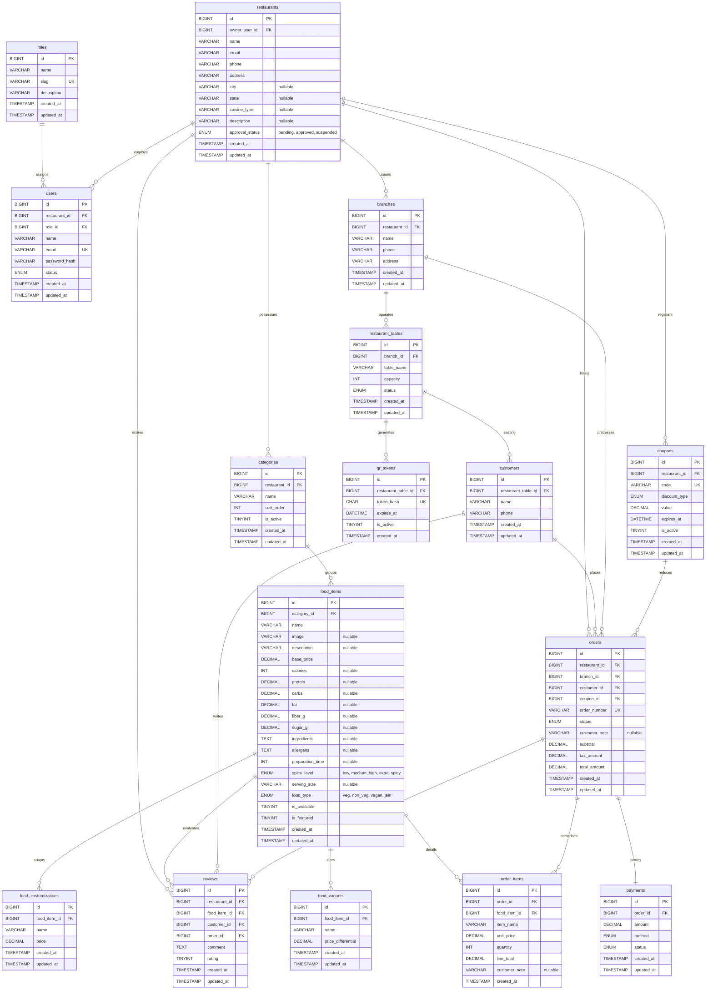

# Entity Relationship Diagram (ERD) & Technical Database Design (Simplified V5)

This document details the professional, simplified relational database design for **Healthy Bite – QR-Based Digital Menu & Food Ordering System** optimized for BCA Semester V. 

The schema is in Third Normal Form (3NF), utilizes `BIGINT` for all primary keys, adheres to MySQL 8.0 standards, and excludes complex enterprise modules to focus on single-semester academic execution.

---

## 1. Professional ER Diagram (Mermaid Relational Notation)

Below is the visual relationship schema represented in standard Mermaid.js notation.



---

## 2. Mermaid Code (Draw.io Compatible)

To import this diagram directly into **Draw.io**:
1. Open Draw.io.
2. Go to `Arrange` > `Insert` > `Advanced` > `Mermaid`.
3. Paste the following compatible Mermaid syntax:

```text
classDiagram
    class roles {
        +BIGINT id
        +VARCHAR name
        +VARCHAR slug
        +VARCHAR description
        +TIMESTAMP created_at
        +TIMESTAMP updated_at
    }
    class users {
        +BIGINT id
        +BIGINT restaurant_id
        +BIGINT role_id
        +VARCHAR name
        +VARCHAR email
        +VARCHAR password_hash
        +ENUM status
        +TIMESTAMP created_at
        +TIMESTAMP updated_at
    }
    class restaurants {
        +BIGINT id
        +BIGINT owner_user_id
        +VARCHAR name
        +VARCHAR email
        +VARCHAR phone
        +VARCHAR address
        +VARCHAR city
        +VARCHAR state
        +VARCHAR cuisine_type
        +VARCHAR description
        +ENUM approval_status
        +TIMESTAMP created_at
        +TIMESTAMP updated_at
    }
    class branches {
        +BIGINT id
        +BIGINT restaurant_id
        +VARCHAR name
        +VARCHAR phone
        +VARCHAR address
        +TIMESTAMP created_at
        +TIMESTAMP updated_at
    }
    class categories {
        +BIGINT id
        +BIGINT restaurant_id
        +VARCHAR name
        +INT sort_order
        +TINYINT is_active
        +TIMESTAMP created_at
        +TIMESTAMP updated_at
    }
    class food_items {
        +BIGINT id
        +BIGINT category_id
        +VARCHAR name
        +VARCHAR image
        +VARCHAR description
        +DECIMAL base_price
        +INT calories
        +DECIMAL protein
        +DECIMAL carbs
        +DECIMAL fat
        +DECIMAL fiber_g
        +DECIMAL sugar_g
        +TEXT ingredients
        +TEXT allergens
        +INT preparation_time
        +ENUM spice_level
        +ENUM food_type
        +TINYINT is_available
        +TINYINT is_featured
        +TIMESTAMP created_at
        +TIMESTAMP updated_at
    }
    class food_variants {
        +BIGINT id
        +BIGINT food_item_id
        +VARCHAR name
        +DECIMAL price_differential
        +TIMESTAMP created_at
        +TIMESTAMP updated_at
    }
    class food_customizations {
        +BIGINT id
        +BIGINT food_item_id
        +VARCHAR name
        +DECIMAL price
        +TIMESTAMP created_at
        +TIMESTAMP updated_at
    }
    class restaurant_tables {
        +BIGINT id
        +BIGINT branch_id
        +VARCHAR table_name
        +INT capacity
        +ENUM status
        +TIMESTAMP created_at
        +TIMESTAMP updated_at
    }
    class qr_tokens {
        +BIGINT id
        +BIGINT restaurant_table_id
        +CHAR token_hash
        +DATETIME expires_at
        +TINYINT is_active
        +TIMESTAMP created_at
    }
    class customers {
        +BIGINT id
        +BIGINT restaurant_table_id
        +VARCHAR name
        +VARCHAR phone
        +TIMESTAMP created_at
        +TIMESTAMP updated_at
    }
    class orders {
        +BIGINT id
        +BIGINT restaurant_id
        +BIGINT branch_id
        +BIGINT customer_id
        +BIGINT coupon_id
        +VARCHAR order_number
        +ENUM status
        +VARCHAR customer_note
        +DECIMAL subtotal
        +DECIMAL tax_amount
        +DECIMAL total_amount
        +TIMESTAMP created_at
        +TIMESTAMP updated_at
    }
    class order_items {
        +BIGINT id
        +BIGINT order_id
        +BIGINT food_item_id
        +VARCHAR item_name
        +DECIMAL unit_price
        +INT quantity
        +DECIMAL line_total
        +VARCHAR customer_note
        +TIMESTAMP created_at
    }
    class payments {
        +BIGINT id
        +BIGINT order_id
        +DECIMAL amount
        +ENUM method
        +ENUM status
        +TIMESTAMP created_at
        +TIMESTAMP updated_at
    }
    class coupons {
        +BIGINT id
        +BIGINT restaurant_id
        +VARCHAR code
        +ENUM discount_type
        +DECIMAL value
        +DATETIME expires_at
        +TINYINT is_active
        +TIMESTAMP created_at
        +TIMESTAMP updated_at
    }
    class reviews {
        +BIGINT id
        +BIGINT restaurant_id
        +BIGINT food_item_id
        +BIGINT customer_id
        +BIGINT order_id
        +TEXT comment
        +TINYINT rating
        +TIMESTAMP created_at
        +TIMESTAMP updated_at
    }

    roles "1" -- "0..*" users : assigns
    restaurants "1" -- "0..*" users : employs
    restaurants "1" -- "0..*" branches : spans
    restaurants "1" -- "0..*" categories : possesses
    restaurants "1" -- "0..*" coupons : registers
    restaurants "1" -- "0..*" orders : billing
    restaurants "1" -- "0..*" reviews : scores
    categories "1" -- "0..*" food_items : groups
    food_items "1" -- "0..*" food_variants : sizes
    food_items "1" -- "0..*" food_customizations : adapts
    food_items "1" -- "0..*" order_items : details
    food_items "1" -- "0..*" reviews : evaluates
    branches "1" -- "0..*" restaurant_tables : operates
    restaurant_tables "1" -- "0..*" qr_tokens : generates
    restaurant_tables "1" -- "0..*" customers : seating
    customers "1" -- "0..*" orders : places
    customers "1" -- "0..*" reviews : writes
    branches "1" -- "0..*" orders : processes
    coupons "1" -- "0..* " orders : reduces
    orders "1" -- "0..*" order_items : comprises
    orders "1" -- "0..*" reviews : verifies
    orders "1" -- "1" payments : settles
```

---

## 3. DBDiagram.io Code

Copy and paste this schema code into [DBDiagram.io](https://dbdiagram.io) to dynamically render and configure the simplified database tables:

```text
Table roles {
  id bigint [pk, increment]
  name varchar
  slug varchar [unique]
  description varchar
  created_at timestamp
  updated_at timestamp
}

Table users {
  id bigint [pk, increment]
  restaurant_id bigint
  role_id bigint
  name varchar
  email varchar [unique]
  password_hash varchar
  status varchar
  created_at timestamp
  updated_at timestamp
}

Table restaurants {
  id bigint [pk, increment]
  owner_user_id bigint
  name varchar
  email varchar
  phone varchar
  address varchar
  city varchar
  state varchar
  cuisine_type varchar
  description varchar
  approval_status varchar
  created_at timestamp
  updated_at timestamp
}

Table branches {
  id bigint [pk, increment]
  restaurant_id bigint
  name varchar
  phone varchar
  address varchar
  created_at timestamp
  updated_at timestamp
}

Table categories {
  id bigint [pk, increment]
  restaurant_id bigint
  name varchar
  sort_order int
  is_active tinyint
  created_at timestamp
  updated_at timestamp
}

Table food_items {
  id bigint [pk, increment]
  category_id bigint
  name varchar
  image varchar
  description varchar
  base_price decimal
  calories int
  protein decimal
  carbs decimal
  fat decimal
  fiber_g decimal
  sugar_g decimal
  ingredients text
  allergens text
  preparation_time int
  spice_level varchar
  food_type varchar
  is_available tinyint
  is_featured tinyint
  created_at timestamp
  updated_at timestamp
}

Table food_variants {
  id bigint [pk, increment]
  food_item_id bigint
  name varchar
  price_differential decimal
  created_at timestamp
  updated_at timestamp
}

Table food_customizations {
  id bigint [pk, increment]
  food_item_id bigint
  name varchar
  price decimal
  created_at timestamp
  updated_at timestamp
}

Table restaurant_tables {
  id bigint [pk, increment]
  branch_id bigint
  table_name varchar
  capacity int
  status varchar
  created_at timestamp
  updated_at timestamp
}

Table qr_tokens {
  id bigint [pk, increment]
  restaurant_table_id bigint
  token_hash char [unique]
  expires_at datetime
  is_active tinyint
  created_at timestamp
}

Table customers {
  id bigint [pk, increment]
  restaurant_table_id bigint
  name varchar
  phone varchar
  created_at timestamp
  updated_at timestamp
}

Table orders {
  id bigint [pk, increment]
  restaurant_id bigint
  branch_id bigint
  customer_id bigint
  coupon_id bigint
  order_number varchar [unique]
  status varchar
  customer_note varchar
  subtotal decimal
  tax_amount decimal
  total_amount decimal
  created_at timestamp
  updated_at timestamp
}

Table order_items {
  id bigint [pk, increment]
  order_id bigint
  food_item_id bigint
  item_name varchar
  unit_price decimal
  quantity int
  line_total decimal
  customer_note varchar
  created_at timestamp
}

Table payments {
  id bigint [pk, increment]
  order_id bigint
  amount decimal
  method varchar
  status varchar
  created_at timestamp
  updated_at timestamp
}

Table coupons {
  id bigint [pk, increment]
  restaurant_id bigint
  code varchar [unique]
  discount_type varchar
  value decimal
  expires_at datetime
  is_active tinyint
  created_at timestamp
  updated_at timestamp
}

Table reviews {
  id bigint [pk, increment]
  restaurant_id bigint
  food_item_id bigint
  customer_id bigint
  order_id bigint
  comment text
  rating tinyint
  created_at timestamp
  updated_at timestamp
}

Ref: roles.id < users.role_id
Ref: restaurants.id < users.restaurant_id
Ref: restaurants.id < branches.restaurant_id
Ref: restaurants.id < categories.restaurant_id
Ref: restaurants.id < coupons.restaurant_id
Ref: restaurants.id < orders.restaurant_id
Ref: restaurants.id < reviews.restaurant_id
Ref: categories.id < food_items.category_id
Ref: food_items.id < food_variants.food_item_id
Ref: food_items.id < food_customizations.food_item_id
Ref: food_items.id < order_items.food_item_id
Ref: food_items.id < reviews.food_item_id
Ref: branches.id < restaurant_tables.branch_id
Ref: restaurant_tables.id < qr_tokens.restaurant_table_id
Ref: restaurant_tables.id < customers.restaurant_table_id
Ref: customers.id < orders.customer_id
Ref: customers.id < reviews.customer_id
Ref: branches.id < orders.branch_id
Ref: coupons.id < orders.coupon_id
Ref: orders.id < order_items.order_id
Ref: orders.id < reviews.order_id
Ref: orders.id - payments.order_id
```

---

## 4. MySQL 8.0 CREATE TABLE Statements

Paste this schema creation SQL code into phpMyAdmin or connect via CLI to instantiate the 16 tables.

```sql
CREATE DATABASE IF NOT EXISTS healthy_bite
    CHARACTER SET utf8mb4
    COLLATE utf8mb4_unicode_ci;

USE healthy_bite;

-- 1. roles table
CREATE TABLE IF NOT EXISTS roles (
    id BIGINT UNSIGNED AUTO_INCREMENT PRIMARY KEY,
    name VARCHAR(80) NOT NULL,
    slug VARCHAR(80) NOT NULL,
    description VARCHAR(255) NULL,
    created_at TIMESTAMP NOT NULL DEFAULT CURRENT_TIMESTAMP,
    updated_at TIMESTAMP NOT NULL DEFAULT CURRENT_TIMESTAMP ON UPDATE CURRENT_TIMESTAMP,
    UNIQUE KEY roles_slug_unique (slug)
) ENGINE=InnoDB DEFAULT CHARSET=utf8mb4 COLLATE=utf8mb4_unicode_ci;

-- 2. restaurants table
CREATE TABLE IF NOT EXISTS restaurants (
    id BIGINT UNSIGNED AUTO_INCREMENT PRIMARY KEY,
    owner_user_id BIGINT UNSIGNED NOT NULL,
    name VARCHAR(160) NOT NULL,
    email VARCHAR(190) NOT NULL,
    phone VARCHAR(30) NOT NULL,
    address VARCHAR(500) NOT NULL,
    city VARCHAR(120) NULL,
    state VARCHAR(120) NULL,
    cuisine_type VARCHAR(120) NULL,
    description VARCHAR(1000) NULL,
    approval_status ENUM('pending', 'approved', 'suspended') NOT NULL DEFAULT 'pending',
    created_at TIMESTAMP NOT NULL DEFAULT CURRENT_TIMESTAMP,
    updated_at TIMESTAMP NOT NULL DEFAULT CURRENT_TIMESTAMP ON UPDATE CURRENT_TIMESTAMP,
    KEY restaurants_owner_user_id_index (owner_user_id)
) ENGINE=InnoDB DEFAULT CHARSET=utf8mb4 COLLATE=utf8mb4_unicode_ci;

-- 3. users table
CREATE TABLE IF NOT EXISTS users (
    id BIGINT UNSIGNED AUTO_INCREMENT PRIMARY KEY,
    restaurant_id BIGINT UNSIGNED NULL,
    role_id BIGINT UNSIGNED NOT NULL,
    name VARCHAR(120) NOT NULL,
    email VARCHAR(190) NOT NULL,
    password_hash VARCHAR(255) NOT NULL,
    status ENUM('active', 'inactive') NOT NULL DEFAULT 'active',
    created_at TIMESTAMP NOT NULL DEFAULT CURRENT_TIMESTAMP,
    updated_at TIMESTAMP NOT NULL DEFAULT CURRENT_TIMESTAMP ON UPDATE CURRENT_TIMESTAMP,
    UNIQUE KEY users_email_unique (email),
    CONSTRAINT fk_users_restaurant FOREIGN KEY (restaurant_id) REFERENCES restaurants (id) ON DELETE SET NULL ON UPDATE CASCADE,
    CONSTRAINT fk_users_role FOREIGN KEY (role_id) REFERENCES roles (id) ON DELETE RESTRICT ON UPDATE CASCADE
) ENGINE=InnoDB DEFAULT CHARSET=utf8mb4 COLLATE=utf8mb4_unicode_ci;

-- 4. branches table
CREATE TABLE IF NOT EXISTS branches (
    id BIGINT UNSIGNED AUTO_INCREMENT PRIMARY KEY,
    restaurant_id BIGINT UNSIGNED NOT NULL,
    name VARCHAR(160) NOT NULL,
    phone VARCHAR(30) NOT NULL,
    address VARCHAR(500) NOT NULL,
    created_at TIMESTAMP NOT NULL DEFAULT CURRENT_TIMESTAMP,
    updated_at TIMESTAMP NOT NULL DEFAULT CURRENT_TIMESTAMP ON UPDATE CURRENT_TIMESTAMP,
    CONSTRAINT fk_branches_restaurant FOREIGN KEY (restaurant_id) REFERENCES restaurants (id) ON DELETE CASCADE ON UPDATE CASCADE
) ENGINE=InnoDB DEFAULT CHARSET=utf8mb4 COLLATE=utf8mb4_unicode_ci;

-- 5. categories table
CREATE TABLE IF NOT EXISTS categories (
    id BIGINT UNSIGNED AUTO_INCREMENT PRIMARY KEY,
    restaurant_id BIGINT UNSIGNED NOT NULL,
    name VARCHAR(120) NOT NULL,
    sort_order INT NOT NULL DEFAULT 0,
    is_active TINYINT(1) NOT NULL DEFAULT 1,
    created_at TIMESTAMP NOT NULL DEFAULT CURRENT_TIMESTAMP,
    updated_at TIMESTAMP NOT NULL DEFAULT CURRENT_TIMESTAMP ON UPDATE CURRENT_TIMESTAMP,
    CONSTRAINT fk_categories_restaurant FOREIGN KEY (restaurant_id) REFERENCES restaurants (id) ON DELETE CASCADE ON UPDATE CASCADE
) ENGINE=InnoDB DEFAULT CHARSET=utf8mb4 COLLATE=utf8mb4_unicode_ci;

-- 6. food_items table
CREATE TABLE IF NOT EXISTS food_items (
    id BIGINT UNSIGNED AUTO_INCREMENT PRIMARY KEY,
    category_id BIGINT UNSIGNED NOT NULL,
    name VARCHAR(160) NOT NULL,
    image VARCHAR(255) NULL,
    description VARCHAR(1000) NULL,
    base_price DECIMAL(10, 2) NOT NULL,
    calories INT NULL,
    protein DECIMAL(5, 2) NULL,
    carbs DECIMAL(5, 2) NULL,
    fat DECIMAL(5, 2) NULL,
    fiber_g DECIMAL(5, 2) NULL,
    sugar_g DECIMAL(5, 2) NULL,
    ingredients TEXT NULL,
    allergens TEXT NULL,
    preparation_time INT NULL COMMENT 'in minutes',
    spice_level ENUM('low', 'medium', 'high', 'extra_spicy') NOT NULL DEFAULT 'medium',
    serving_size VARCHAR(80) NULL,
    food_type ENUM('veg', 'non_veg', 'vegan', 'jain') NOT NULL DEFAULT 'veg',
    is_available TINYINT(1) NOT NULL DEFAULT 1,
    is_featured TINYINT(1) NOT NULL DEFAULT 0,
    created_at TIMESTAMP NOT NULL DEFAULT CURRENT_TIMESTAMP,
    updated_at TIMESTAMP NOT NULL DEFAULT CURRENT_TIMESTAMP ON UPDATE CURRENT_TIMESTAMP,
    CONSTRAINT fk_food_items_category FOREIGN KEY (category_id) REFERENCES categories (id) ON DELETE RESTRICT ON UPDATE CASCADE
) ENGINE=InnoDB DEFAULT CHARSET=utf8mb4 COLLATE=utf8mb4_unicode_ci;

-- 7. food_variants table
CREATE TABLE IF NOT EXISTS food_variants (
    id BIGINT UNSIGNED AUTO_INCREMENT PRIMARY KEY,
    food_item_id BIGINT UNSIGNED NOT NULL,
    name VARCHAR(80) NOT NULL COMMENT 'e.g. Small, Medium, Large',
    price_differential DECIMAL(10, 2) NOT NULL DEFAULT 0.00,
    created_at TIMESTAMP NOT NULL DEFAULT CURRENT_TIMESTAMP,
    updated_at TIMESTAMP NOT NULL DEFAULT CURRENT_TIMESTAMP ON UPDATE CURRENT_TIMESTAMP,
    CONSTRAINT fk_food_variants_food_item FOREIGN KEY (food_item_id) REFERENCES food_items (id) ON DELETE CASCADE ON UPDATE CASCADE
) ENGINE=InnoDB DEFAULT CHARSET=utf8mb4 COLLATE=utf8mb4_unicode_ci;

-- 8. food_customizations table
CREATE TABLE IF NOT EXISTS food_customizations (
    id BIGINT UNSIGNED AUTO_INCREMENT PRIMARY KEY,
    food_item_id BIGINT UNSIGNED NOT NULL,
    name VARCHAR(120) NOT NULL COMMENT 'e.g. Extra Cheese, Extra Paneer',
    price DECIMAL(10, 2) NOT NULL DEFAULT 0.00,
    created_at TIMESTAMP NOT NULL DEFAULT CURRENT_TIMESTAMP,
    updated_at TIMESTAMP NOT NULL DEFAULT CURRENT_TIMESTAMP ON UPDATE CURRENT_TIMESTAMP,
    CONSTRAINT fk_food_customizations_food_item FOREIGN KEY (food_item_id) REFERENCES food_items (id) ON DELETE CASCADE ON UPDATE CASCADE
) ENGINE=InnoDB DEFAULT CHARSET=utf8mb4 COLLATE=utf8mb4_unicode_ci;

-- 9. restaurant_tables table
CREATE TABLE IF NOT EXISTS restaurant_tables (
    id BIGINT UNSIGNED AUTO_INCREMENT PRIMARY KEY,
    branch_id BIGINT UNSIGNED NOT NULL,
    table_name VARCHAR(80) NOT NULL,
    capacity INT NOT NULL DEFAULT 2,
    status ENUM('available', 'occupied', 'reserved', 'cleaning', 'inactive') NOT NULL DEFAULT 'available',
    created_at TIMESTAMP NOT NULL DEFAULT CURRENT_TIMESTAMP,
    updated_at TIMESTAMP NOT NULL DEFAULT CURRENT_TIMESTAMP ON UPDATE CURRENT_TIMESTAMP,
    CONSTRAINT fk_restaurant_tables_branch FOREIGN KEY (branch_id) REFERENCES branches (id) ON DELETE CASCADE ON UPDATE CASCADE
) ENGINE=InnoDB DEFAULT CHARSET=utf8mb4 COLLATE=utf8mb4_unicode_ci;

-- 10. qr_tokens table
CREATE TABLE IF NOT EXISTS qr_tokens (
    id BIGINT UNSIGNED AUTO_INCREMENT PRIMARY KEY,
    restaurant_table_id BIGINT UNSIGNED NOT NULL,
    token_hash CHAR(64) NOT NULL,
    expires_at DATETIME NULL,
    is_active TINYINT(1) NOT NULL DEFAULT 1,
    created_at TIMESTAMP NOT NULL DEFAULT CURRENT_TIMESTAMP,
    UNIQUE KEY qr_tokens_hash_unique (token_hash),
    CONSTRAINT fk_qr_tokens_table FOREIGN KEY (restaurant_table_id) REFERENCES restaurant_tables (id) ON DELETE CASCADE ON UPDATE CASCADE
) ENGINE=InnoDB DEFAULT CHARSET=utf8mb4 COLLATE=utf8mb4_unicode_ci;

-- 11. customers table
CREATE TABLE IF NOT EXISTS customers (
    id BIGINT UNSIGNED AUTO_INCREMENT PRIMARY KEY,
    restaurant_table_id BIGINT UNSIGNED NULL,
    name VARCHAR(120) NOT NULL,
    phone VARCHAR(30) NULL,
    created_at TIMESTAMP NOT NULL DEFAULT CURRENT_TIMESTAMP,
    updated_at TIMESTAMP NOT NULL DEFAULT CURRENT_TIMESTAMP ON UPDATE CURRENT_TIMESTAMP,
    CONSTRAINT fk_customers_table FOREIGN KEY (restaurant_table_id) REFERENCES restaurant_tables (id) ON DELETE SET NULL ON UPDATE CASCADE
) ENGINE=InnoDB DEFAULT CHARSET=utf8mb4 COLLATE=utf8mb4_unicode_ci;

-- 12. coupons table
CREATE TABLE IF NOT EXISTS coupons (
    id BIGINT UNSIGNED AUTO_INCREMENT PRIMARY KEY,
    restaurant_id BIGINT UNSIGNED NOT NULL,
    code VARCHAR(50) NOT NULL,
    discount_type ENUM('percentage', 'fixed') NOT NULL DEFAULT 'percentage',
    value DECIMAL(10, 2) NOT NULL,
    expires_at DATETIME NOT NULL,
    is_active TINYINT(1) NOT NULL DEFAULT 1,
    created_at TIMESTAMP NOT NULL DEFAULT CURRENT_TIMESTAMP,
    updated_at TIMESTAMP NOT NULL DEFAULT CURRENT_TIMESTAMP ON UPDATE CURRENT_TIMESTAMP,
    UNIQUE KEY coupons_code_unique (code),
    CONSTRAINT fk_coupons_restaurant FOREIGN KEY (restaurant_id) REFERENCES restaurants (id) ON DELETE CASCADE ON UPDATE CASCADE
) ENGINE=InnoDB DEFAULT CHARSET=utf8mb4 COLLATE=utf8mb4_unicode_ci;

-- 13. orders table
CREATE TABLE IF NOT EXISTS orders (
    id BIGINT UNSIGNED AUTO_INCREMENT PRIMARY KEY,
    restaurant_id BIGINT UNSIGNED NOT NULL,
    branch_id BIGINT UNSIGNED NOT NULL,
    customer_id BIGINT UNSIGNED NOT NULL,
    coupon_id BIGINT UNSIGNED NULL,
    order_number VARCHAR(64) NOT NULL,
    status ENUM('pending', 'accepted', 'preparing', 'ready', 'served', 'completed', 'cancelled') NOT NULL DEFAULT 'pending',
    customer_note VARCHAR(500) NULL,
    subtotal DECIMAL(10, 2) NOT NULL,
    tax_amount DECIMAL(10, 2) NOT NULL DEFAULT 0.00,
    total_amount DECIMAL(10, 2) NOT NULL,
    created_at TIMESTAMP NOT NULL DEFAULT CURRENT_TIMESTAMP,
    updated_at TIMESTAMP NOT NULL DEFAULT CURRENT_TIMESTAMP ON UPDATE CURRENT_TIMESTAMP,
    UNIQUE KEY orders_number_unique (order_number),
    CONSTRAINT fk_orders_restaurant FOREIGN KEY (restaurant_id) REFERENCES restaurants (id) ON DELETE RESTRICT ON UPDATE CASCADE,
    CONSTRAINT fk_orders_branch FOREIGN KEY (branch_id) REFERENCES branches (id) ON DELETE RESTRICT ON UPDATE CASCADE,
    CONSTRAINT fk_orders_customer FOREIGN KEY (customer_id) REFERENCES customers (id) ON DELETE RESTRICT ON UPDATE CASCADE,
    CONSTRAINT fk_orders_coupon FOREIGN KEY (coupon_id) REFERENCES coupons (id) ON DELETE SET NULL ON UPDATE CASCADE
) ENGINE=InnoDB DEFAULT CHARSET=utf8mb4 COLLATE=utf8mb4_unicode_ci;

-- 14. order_items table
CREATE TABLE IF NOT EXISTS order_items (
    id BIGINT UNSIGNED AUTO_INCREMENT PRIMARY KEY,
    order_id BIGINT UNSIGNED NOT NULL,
    food_item_id BIGINT UNSIGNED NULL,
    item_name VARCHAR(160) NOT NULL,
    unit_price DECIMAL(10,2) NOT NULL,
    quantity SMALLINT UNSIGNED NOT NULL,
    line_total DECIMAL(10,2) NOT NULL,
    customer_note VARCHAR(300) NULL,
    created_at TIMESTAMP NOT NULL DEFAULT CURRENT_TIMESTAMP,
    CONSTRAINT fk_order_items_order FOREIGN KEY (order_id) REFERENCES orders (id) ON DELETE CASCADE ON UPDATE CASCADE,
    CONSTRAINT fk_order_items_food FOREIGN KEY (food_item_id) REFERENCES food_items (id) ON DELETE SET NULL ON UPDATE CASCADE
) ENGINE=InnoDB DEFAULT CHARSET=utf8mb4 COLLATE=utf8mb4_unicode_ci;

-- 15. payments table
CREATE TABLE IF NOT EXISTS payments (
    id BIGINT UNSIGNED AUTO_INCREMENT PRIMARY KEY,
    order_id BIGINT UNSIGNED NOT NULL,
    amount DECIMAL(10, 2) NOT NULL,
    method ENUM('cash', 'upi', 'card') NOT NULL,
    status ENUM('pending', 'completed', 'failed') NOT NULL DEFAULT 'pending',
    created_at TIMESTAMP NOT NULL DEFAULT CURRENT_TIMESTAMP,
    updated_at TIMESTAMP NOT NULL DEFAULT CURRENT_TIMESTAMP ON UPDATE CURRENT_TIMESTAMP,
    CONSTRAINT fk_payments_order FOREIGN KEY (order_id) REFERENCES orders (id) ON DELETE CASCADE ON UPDATE CASCADE
) ENGINE=InnoDB DEFAULT CHARSET=utf8mb4 COLLATE=utf8mb4_unicode_ci;

-- 16. reviews table
CREATE TABLE IF NOT EXISTS reviews (
    id BIGINT UNSIGNED AUTO_INCREMENT PRIMARY KEY,
    restaurant_id BIGINT UNSIGNED NOT NULL,
    food_item_id BIGINT UNSIGNED NULL,
    customer_id BIGINT UNSIGNED NOT NULL,
    order_id BIGINT UNSIGNED NULL,
    comment TEXT NOT NULL,
    rating TINYINT UNSIGNED NOT NULL CHECK (rating BETWEEN 1 AND 5),
    created_at TIMESTAMP NOT NULL DEFAULT CURRENT_TIMESTAMP,
    updated_at TIMESTAMP NOT NULL DEFAULT CURRENT_TIMESTAMP ON UPDATE CURRENT_TIMESTAMP,
    CONSTRAINT fk_reviews_restaurant FOREIGN KEY (restaurant_id) REFERENCES restaurants (id) ON DELETE CASCADE ON UPDATE CASCADE,
    CONSTRAINT fk_reviews_food FOREIGN KEY (food_item_id) REFERENCES food_items (id) ON DELETE CASCADE ON UPDATE CASCADE,
    CONSTRAINT fk_reviews_customer FOREIGN KEY (customer_id) REFERENCES customers (id) ON DELETE CASCADE ON UPDATE CASCADE,
    CONSTRAINT fk_reviews_order FOREIGN KEY (order_id) REFERENCES orders (id) ON DELETE SET NULL ON UPDATE CASCADE
) ENGINE=InnoDB DEFAULT CHARSET=utf8mb4 COLLATE=utf8mb4_unicode_ci;
```

---

## 5. Complete Data Dictionary

### 1. `roles`
Stores structural access groups.
- `id` (BIGINT UNSIGNED, PK): Unique auto-increment identifier.
- `name` (VARCHAR(80)): Title (e.g. Owner, Super Admin, Kitchen Staff).
- `slug` (VARCHAR(80), UNIQUE): Opaque identifier (e.g. `owner`, `kitchen_staff`).
- `description` (VARCHAR(255), NULL): Brief description of permissions.
- `created_at` / `updated_at` (TIMESTAMP): Tracking columns.

### 2. `restaurants`
Multi-tenant billing entity.
- `id` (BIGINT UNSIGNED, PK): Unique identifier.
- `owner_user_id` (BIGINT UNSIGNED, FK): Reference to the owner's user account.
- `name` (VARCHAR(160)): Brand name.
- `email` (VARCHAR(190)): Contact email.
- `phone` (VARCHAR(30)): Contact phone number.
- `address` (VARCHAR(500)): Full physical address.
- `city` (VARCHAR(120), NULL): City.
- `state` (VARCHAR(120), NULL): State.
- `cuisine_type` (VARCHAR(120), NULL): Category of cuisine (e.g. Italian, Indian).
- `description` (VARCHAR(1000), NULL): Restaurant description details.
- `approval_status` (ENUM('pending', 'approved', 'suspended')): Platform administrative approval status.
- `created_at` / `updated_at` (TIMESTAMP): Tracking columns.

### 3. `users`
Operational user accounts (management/staff).
- `id` (BIGINT UNSIGNED, PK): Unique identifier.
- `restaurant_id` (BIGINT UNSIGNED, FK, NULL): Belongs to a restaurant.
- `role_id` (BIGINT UNSIGNED, FK): User's role permissions group.
- `name` (VARCHAR(120)): User name.
- `email` (VARCHAR(190), UNIQUE): User login email.
- `password_hash` (VARCHAR(255)): Bcrypt password hash.
- `status` (ENUM('active', 'inactive')): Account state.
- `created_at` / `updated_at` (TIMESTAMP): Tracking columns.

### 4. `branches`
Multiple location outlets under a restaurant brand.
- `id` (BIGINT UNSIGNED, PK): Unique identifier.
- `restaurant_id` (BIGINT UNSIGNED, FK): Parent restaurant reference.
- `name` (VARCHAR(160)): Branch name.
- `phone` (VARCHAR(30)): Contact phone.
- `address` (VARCHAR(500)): Address details.
- `created_at` / `updated_at` (TIMESTAMP): Tracking columns.

### 5. `categories`
Logical category headings for dishes.
- `id` (BIGINT UNSIGNED, PK): Unique identifier.
- `restaurant_id` (BIGINT UNSIGNED, FK): Parent restaurant reference.
- `name` (VARCHAR(120)): Category name (e.g., Starters, Bowls).
- `sort_order` (INT): Listing sequence index.
- `is_active` (TINYINT): Display visibility status.
- `created_at` / `updated_at` (TIMESTAMP): Tracking columns.

### 6. `food_items`
Healthy dishes and products sold.
- `id` (BIGINT UNSIGNED, PK): Unique identifier.
- `category_id` (BIGINT UNSIGNED, FK): Parent category mapping.
- `name` (VARCHAR(160)): Dish name.
- `image` (VARCHAR(255), NULL): Storage path or URL.
- `description` (VARCHAR(1000), NULL): Menu description details.
- `base_price` (DECIMAL(10, 2)): Standard cost.
- `calories` (INT, NULL): Calorie count in kcal.
- `protein` (DECIMAL(5,2), NULL): Protein in grams.
- `carbs` (DECIMAL(5,2), NULL): Carbohydrates in grams.
- `fat` (DECIMAL(5,2), NULL): Fat in grams.
- `fiber_g` (DECIMAL(5,2), NULL): Fiber content in grams.
- `sugar_g` (DECIMAL(5,2), NULL): Sugar content in grams.
- `ingredients` (TEXT, NULL): Text-based ingredient list.
- `allergens` (TEXT, NULL): Comma-separated allergen warnings.
- `preparation_time` (INT, NULL): Cooking duration (mins).
- `spice_level` (ENUM('low', 'medium', 'high', 'extra_spicy')): Heat level indicator.
- `serving_size` (VARCHAR(80), NULL): Default serving size description (e.g. 250ml, 1 Plate).
- `food_type` (ENUM('veg', 'non_veg', 'vegan', 'jain')): Dietary label.
- `is_available` (TINYINT): Instantly toggle out-of-stock items.
- `is_featured` (TINYINT): Displays on recommended landing slots.
- `created_at` / `updated_at` (TIMESTAMP): Tracking columns.

### 7. `food_variants`
Standard sizing options for food items (e.g., Small, Medium, Large).
- `id` (BIGINT UNSIGNED, PK): Unique identifier.
- `food_item_id` (BIGINT UNSIGNED, FK): Parent food item.
- `name` (VARCHAR(80)): Title.
- `price_differential` (DECIMAL(10, 2)): Difference added to the base price.
- `created_at` / `updated_at` (TIMESTAMP): Tracking columns.

### 8. `food_customizations`
Extra modifications (e.g. Extra Cheese, No Onion).
- `id` (BIGINT UNSIGNED, PK): Unique identifier.
- `food_item_id` (BIGINT UNSIGNED, FK): Parent food item.
- `name` (VARCHAR(120)): Custom request title.
- `price` (DECIMAL(10, 2)): Additional cost.
- `created_at` / `updated_at` (TIMESTAMP): Tracking columns.

### 9. `restaurant_tables`
Seating setups inside branches.
- `id` (BIGINT UNSIGNED, PK): Unique identifier.
- `branch_id` (BIGINT UNSIGNED, FK): Outlet mapping.
- `table_name` (VARCHAR(80)): Table label.
- `capacity` (INT): Total seating capacity.
- `status` (ENUM('available', 'occupied', 'reserved', 'cleaning', 'inactive')): Seating state.
- `created_at` / `updated_at` (TIMESTAMP): Tracking columns.

### 10. `qr_tokens`
Opaque QR-mapping credentials for tables.
- `id` (BIGINT UNSIGNED, PK): Unique identifier.
- `restaurant_table_id` (BIGINT UNSIGNED, FK): Associated table.
- `token_hash` (CHAR(64), UNIQUE): Cryptographic access hash.
- `expires_at` (DATETIME, NULL): Expiry time.
- `is_active` (TINYINT): Validity switch.
- `created_at` (TIMESTAMP): Creation timestamp (does not use updated_at).

### 11. `customers`
Seated dining guests.
- `id` (BIGINT UNSIGNED, PK): Unique identifier.
- `restaurant_table_id` (BIGINT UNSIGNED, FK, NULL): Current seating table.
- `name` (VARCHAR(120)): Guest name.
- `phone` (VARCHAR(30), NULL): Contact details.
- `created_at` / `updated_at` (TIMESTAMP): Tracking columns.

### 12. `coupons`
Promo offers and codes.
- `id` (BIGINT UNSIGNED, PK): Unique identifier.
- `restaurant_id` (BIGINT UNSIGNED, FK): Parent restaurant owner.
- `code` (VARCHAR(50), UNIQUE): Promo string code.
- `discount_type` (ENUM('percentage', 'fixed')): Value deduction format.
- `value` (DECIMAL(10, 2)): Value of discount.
- `expires_at` (DATETIME): Expiry date.
- `is_active` (TINYINT): Active switch.
- `created_at` / `updated_at` (TIMESTAMP): Tracking columns.

### 13. `orders`
Master order transactions.
- `id` (BIGINT UNSIGNED, PK): Unique identifier.
- `restaurant_id` (BIGINT UNSIGNED, FK): Billing restaurant.
- `branch_id` (BIGINT UNSIGNED, FK): Serving branch.
- `customer_id` (BIGINT UNSIGNED, FK): Seated customer placing order.
- `coupon_id` (BIGINT UNSIGNED, FK, NULL): Applied promo code.
- `order_number` (VARCHAR(64), UNIQUE): Invoice identifier.
- `status` (ENUM('pending', 'accepted', 'preparing', 'ready', 'served', 'completed', 'cancelled')): Pipeline state.
- `customer_note` (VARCHAR(500), NULL): Special customer request instructions.
- `subtotal` (DECIMAL(10,2)): Net amount before taxes and discounts.
- `tax_amount` (DECIMAL(10,2)): Tax charge amount.
- `total_amount` (DECIMAL(10, 2)): Final total cost of order.
- `created_at` / `updated_at` (TIMESTAMP): Tracking columns.

### 14. `order_items`
Item details in orders.
- `id` (BIGINT UNSIGNED, PK): Unique identifier.
- `order_id` (BIGINT UNSIGNED, FK): Parent order reference.
- `food_item_id` (BIGINT UNSIGNED, FK, NULL): Ordered product mapping.
- `item_name` (VARCHAR(160)): Captured food item name snapshot (retained for historic billing).
- `unit_price` (DECIMAL(10,2)): Captured unit price at order placement.
- `quantity` (SMALLINT UNSIGNED): Count of items ordered.
- `line_total` (DECIMAL(10,2)): Calculated subtotal for this item line (quantity * unit_price).
- `customer_note` (VARCHAR(300), NULL): Custom requests for this specific item.
- `created_at` (TIMESTAMP): Order placement timestamp.

### 15. `payments`
Transactions payments records.
- `id` (BIGINT UNSIGNED, PK): Unique identifier.
- `order_id` (BIGINT UNSIGNED, FK): Associated order.
- `amount` (DECIMAL(10, 2)): Total paid amount.
- `method` (ENUM('cash', 'upi', 'card')): Transaction gateway method.
- `status` (ENUM('pending', 'completed', 'failed')): Settlement state.
- `created_at` / `updated_at` (TIMESTAMP): Tracking columns.

### 16. `reviews`
Reviews of restaurant services and items.
- `id` (BIGINT UNSIGNED, PK): Unique identifier.
- `restaurant_id` (BIGINT UNSIGNED, FK): Subject restaurant.
- `food_item_id` (BIGINT UNSIGNED, FK, NULL): Optional food product reference.
- `customer_id` (BIGINT UNSIGNED, FK): Writing reviewer.
- `order_id` (BIGINT UNSIGNED, FK, NULL): Associated order invoice mapping.
- `comment` (TEXT): Feedback text.
- `rating` (TINYINT): Stars (1-5 range limit).
- `created_at` / `updated_at` (TIMESTAMP): Tracking columns.

---

## 6. Primary Keys (PK) & Foreign Keys (FK)

| Table Name | Primary Key (PK) | Foreign Key(s) (FK) | Referenced Table (Column) |
|---|---|---|---|
| `roles` | `id` | None | - |
| `restaurants` | `id` | None | - |
| `users` | `id` | `restaurant_id`<br>`role_id` | `restaurants(id)` (ON DELETE SET NULL)<br>`roles(id)` (ON DELETE RESTRICT) |
| `branches` | `id` | `restaurant_id` | `restaurants(id)` (ON DELETE CASCADE) |
| `categories` | `id` | `restaurant_id` | `restaurants(id)` (ON DELETE CASCADE) |
| `food_items` | `id` | `category_id` | `categories(id)` (ON DELETE RESTRICT) |
| `food_variants` | `id` | `food_item_id` | `food_items(id)` (ON DELETE CASCADE) |
| `food_customizations`| `id` | `food_item_id` | `food_items(id)` (ON DELETE CASCADE) |
| `restaurant_tables` | `id` | `branch_id` | `branches(id)` (ON DELETE CASCADE) |
| `qr_tokens` | `id` | `restaurant_table_id`| `restaurant_tables(id)` (ON DELETE CASCADE) |
| `customers` | `id` | `restaurant_table_id`| `restaurant_tables(id)` (ON DELETE SET NULL) |
| `coupons` | `id` | `restaurant_id` | `restaurants(id)` (ON DELETE CASCADE) |
| `orders` | `id` | `restaurant_id`<br>`branch_id`<br>`customer_id`<br>`coupon_id` | `restaurants(id)` (ON DELETE RESTRICT)<br>`branches(id)` (ON DELETE RESTRICT)<br>`customers(id)` (ON DELETE RESTRICT)<br>`coupons(id)` (ON DELETE SET NULL) |
| `order_items` | `id` | `order_id`<br>`food_item_id` | `orders(id)` (ON DELETE CASCADE)<br>`food_items(id)` (ON DELETE RESTRICT) |
| `payments` | `id` | `order_id` | `orders(id)` (ON DELETE CASCADE) |
| `reviews` | `id` | `restaurant_id`<br>`food_item_id`<br>`customer_id`<br>`order_id` | `restaurants(id)` (ON DELETE CASCADE)<br>`food_items(id)` (ON DELETE CASCADE)<br>`customers(id)` (ON DELETE CASCADE)<br>`orders(id)` (ON DELETE SET NULL) |

---

## 7. Cardinality & Relationship Explanations

### Structural Rules

1. **`roles` to `users` (1 : M):** A system role (e.g. Manager) applies to multiple users, but each user holds exactly one role.
2. **`restaurants` to `branches` (1 : M):** A restaurant brand operates one or more branches. A branch belongs to exactly one parent restaurant.
3. **`restaurants` to `users` (1 : M):** Operational managers/staff belong to one restaurant tenant.
4. **`restaurants` to `categories` (1 : M):** Each tenant has multiple distinct menu categories (e.g., Appetizers).
5. **`restaurants` to `coupons` (1 : M):** Promo codes are registered under a specific parent restaurant.
6. **`restaurants` to `orders` (1 : M):** Orders are processed and billed under a specific parent restaurant.
7. **`restaurants` to `reviews` (1 : M):** General restaurant feedback points back to the main tenant.
8. **`categories` to `food_items` (1 : M):** A category contains multiple items; each item is organized under one category.
9. **`food_items` to `food_variants` (1 : M):** A food item (e.g. Pizza) maps to multiple size variants (e.g. Small, Medium, Large).
10. **`food_items` to `food_customizations` (1 : M):** A dish supports multiple custom items (e.g. Extra Cheese).
11. **`branches` to `restaurant_tables` (1 : M):** Physical tables are placed and operated inside a specific branch location.
12. **`restaurant_tables` to `qr_tokens` (1 : M):** A table generates multiple QR tokens over time (though only one is active at a time).
13. **`restaurant_tables` to `customers` (1 : M):** Seated customer guests occupy exactly one dining table at a time.
14. **`customers` to `orders` (1 : M):** A guest can submit multiple order requests.
15. **`customers` to `reviews` (1 : M):** A customer can write multiple reviews.
16. **`branches` to `orders` (1 : M):** A branch processes multiple physical table transactions.
17. **`coupons` to `orders` (1 : M):** A coupon code can reduce totals on multiple order bills.
18. **`orders` to `order_items` (1 : M):** A single invoice holds multiple purchased item details.
19. **`orders` to `payments` (1 : 1):** An order has exactly one payment transaction settling it.
20. **`orders` to `reviews` (1 : M):** Reviews can reference specific invoices to verify purchases.
21. **`food_items` to `reviews` (1 : M):** Reviews can evaluate individual menu dishes.
