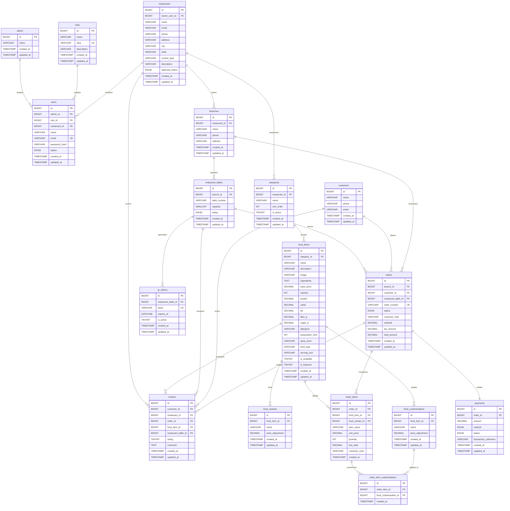

# Entity Relationship Diagram (ERD) & Technical Database Design (Authoritative 17-Table Schema)

This document details the relational database design for **Healthy Bite – QR-Based Digital Menu & Food Ordering System**. 

The schema is in Third Normal Form (3NF), utilizes `BIGINT` for all primary keys, adheres to MySQL 8.0 standards, and consists of **exactly 17 tables**.

---

## 1. Professional ER Diagram (Mermaid Relational Notation)

Below is the visual relationship schema represented in standard Mermaid.js notation.

---

## 2. Table Directory (Authoritative 17 Tables)

1. **`admin`**: Platform administration master records.
2. **`roles`**: Master definitions for system roles (`super_admin`, `owner`, `manager`, `staff`).
3. **`users`**: User identities associated with roles and restaurant tenants.
4. **`restaurants`**: Tenant profiles and billing owners.
5. **`branches`**: Physical locations operated by restaurants.
6. **`categories`**: Menu groups (Appetizers, Mains, Smoothies, Salads).
7. **`food_items`**: Sellable dishes with pricing, allergen notes, and dietary classifications.
8. **`food_variants`**: Size and portion modifiers (e.g. Regular, Large Bowl).
9. **`food_customizations`**: Add-ons (e.g. Extra Avocado, Feta Cheese).
10. **`restaurant_tables`**: Physical dining seating at a branch.
11. **`qr_tokens`**: Table QR tokens for instant ordering.
12. **`customers`**: Guest diner profiles.
13. **`orders`**: Dining order tickets and lifecycle states.
14. **`order_items`**: Snapshot of foods ordered in a ticket.
15. **`order_item_customizations`**: Bridge mapping selected add-ons to order items.
16. **`payments`**: Payment transaction settlements.
17. **`reviews`**: Ratings and customer feedback.

---

## 3. Relational Foreign Key Matrix

| Child Table | Foreign Key Column | Parent Table (`PK`) | Delete Rule | Update Rule |
| :--- | :--- | :--- | :--- | :--- |
| `users` | `admin_id` | `admin(id)` | `SET NULL` | `CASCADE` |
| `users` | `role_id` | `roles(id)` | `RESTRICT` | `CASCADE` |
| `users` | `restaurant_id` | `restaurants(id)` | `SET NULL` | `CASCADE` |
| `restaurants` | `owner_user_id` | `users(id)` | `SET NULL` | `CASCADE` |
| `branches` | `restaurant_id` | `restaurants(id)` | `CASCADE` | `CASCADE` |
| `categories` | `restaurant_id` | `restaurants(id)` | `CASCADE` | `CASCADE` |
| `food_items` | `category_id` | `categories(id)` | `RESTRICT` | `CASCADE` |
| `food_variants` | `food_item_id` | `food_items(id)` | `CASCADE` | `CASCADE` |
| `food_customizations` | `food_item_id` | `food_items(id)` | `CASCADE` | `CASCADE` |
| `restaurant_tables` | `branch_id` | `branches(id)` | `CASCADE` | `CASCADE` |
| `qr_tokens` | `restaurant_table_id` | `restaurant_tables(id)` | `CASCADE` | `CASCADE` |
| `orders` | `branch_id` | `branches(id)` | `RESTRICT` | `CASCADE` |
| `orders` | `customer_id` | `customers(id)` | `RESTRICT` | `CASCADE` |
| `orders` | `restaurant_table_id` | `restaurant_tables(id)` | `RESTRICT` | `CASCADE` |
| `order_items` | `order_id` | `orders(id)` | `CASCADE` | `CASCADE` |
| `order_items` | `food_item_id` | `food_items(id)` | `RESTRICT` | `CASCADE` |
| `order_items` | `food_variant_id` | `food_variants(id)` | `SET NULL` | `CASCADE` |
| `order_item_customizations` | `order_item_id` | `order_items(id)` | `CASCADE` | `CASCADE` |
| `order_item_customizations` | `food_customization_id` | `food_customizations(id)` | `CASCADE` | `CASCADE` |
| `payments` | `order_id` | `orders(id)` | `CASCADE` | `CASCADE` |
| `reviews` | `customer_id` | `customers(id)` | `CASCADE` | `CASCADE` |
| `reviews` | `restaurant_id` | `restaurants(id)` | `CASCADE` | `CASCADE` |
| `reviews` | `order_id` | `orders(id)` | `SET NULL` | `CASCADE` |
| `reviews` | `food_item_id` | `food_items(id)` | `SET NULL` | `CASCADE` |
| `reviews` | `restaurant_table_id` | `restaurant_tables(id)` | `SET NULL` | `CASCADE` |
