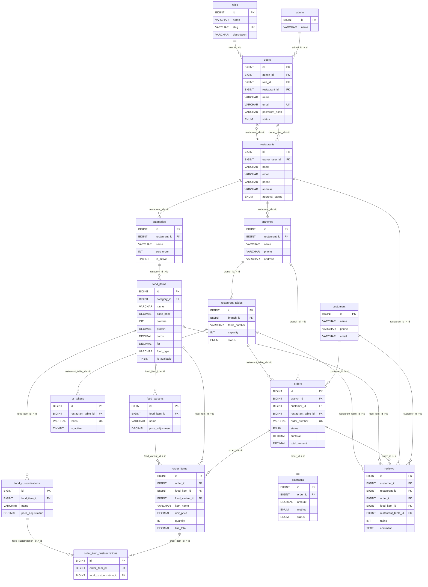

# Core Database ER Diagram (Authoritative 17-Table Architecture)

This diagram details the authoritative **17 core tables** that power the complete Healthy Bite platform (Authentication, Roles, Tenantry, Branches, Menu, Customizations, Variants, Seating, Ordering, Reviews, and Payments).

---

## 1. 17-Table Core ER Diagram

---

## 2. Table Directory (Authoritative 17 Tables)

1. **admin**: Platform Administration master entity.
2. **roles**: Master lookup for user roles (Super Admin, Owner, Manager, Staff).
3. **users**: Operational accounts scoped to roles and restaurant tenants.
4. **restaurants**: Core billing tenant profile.
5. **branches**: Geographically distinct physical locations.
6. **categories**: Logical menu groupings.
7. **food_items**: Dishes with prices, nutrition, allergens, and dietary tags.
8. **food_variants**: Sizing / portion variations.
9. **food_customizations**: Ingredient add-ons & extras.
10. **restaurant_tables**: Physical tables at a branch.
11. **qr_tokens**: Dynamic QR access tokens.
12. **customers**: Guest ordering profiles.
13. **orders**: Transactions and kitchen tickets.
14. **order_items**: Line-item breakdown.
15. **order_item_customizations**: Add-on bridge for order items.
16. **payments**: Point-of-sale settlements and references.
17. **reviews**: Customer feedback and star ratings.
