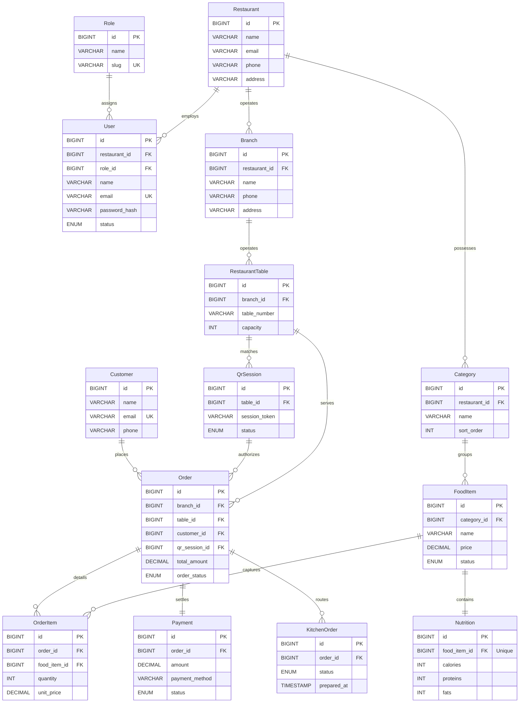

# Core Database ER Diagram (80/20 Ruleset for Documentation)

This diagram applies the **80/20 principle (Pareto Principle)** to the Healthy Bite SaaS platform. It condenses the 50+ database tables down to the **14 core tables** that drive 80%+ of the system's functionality (Authentication, Tenantry, Menu, Seating Sessions, Order Placement, Kitchen Routing, and Payments). 

This version is optimal for project reports, system documentation, and student viva presentations, keeping the codebase easy to explain and draw.

---

## 1. 80/20 Core ER Diagram

---

## 2. Table Directory (80/20 Core Engine)

These 14 entities provide the foundation for the entire multi-tenant SaaS application flow:

1. **Role**: Dictates user permissions and administration access levels (Owner, Cashier, Kitchen, Waiter).
2. **User**: Operational accounts scoped to specific restaurants via `restaurant_id`.
3. **Restaurant**: The core billing tenant mapping overall corporate details.
4. **Branch**: Splits single restaurants into geographically isolated, physical locations.
5. **Category**: Logical menus groupings (Appetizers, Mains, Drinks) configured by the Tenant.
6. **FoodItem**: Individual dishes containing price fields, descriptions, and statuses.
7. **Nutrition**: Holds dietary values such as proteins, calories, fats for a particular `food_item_id`.
8. **RestaurantTable**: Physical restaurant dining tables where QR tokens are placed.
9. **QrSession**: Tracks active guest devices and tables during an ordering flow.
10. **Customer**: Guest ordering profiles.
11. **Order**: Relational transaction ticket tracking statuses (Pending, Preparing, Completed, Cancelled).
12. **OrderItem**: Line-item details specifying order counts and prices of chosen foods.
13. **KitchenOrder**: Routes order details into kitchen queue streams.
14. **Payment**: Handles point-of-sale settlements, payment options, and references.
