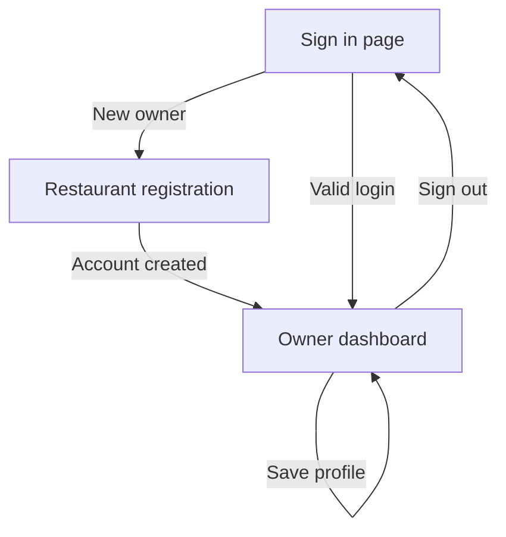

# Current Page Inventory

This document lists all Healthy Bite pages implemented in **Stage 1**. The project currently focuses on restaurant owner onboarding, authentication, and profile management. Customer QR ordering, menu, tables, and staff pages are planned for later stages.

## Implemented pages

| Page | URL | Access | Purpose | Status |
| --- | --- | --- | --- | --- |
| Owner sign in | `/` or `/login` | Guest only | Lets a restaurant admin/owner sign in using email and password. | Complete |
| Restaurant registration | `/register` | Guest only | Creates an owner account and initial restaurant profile. | Complete |
| Owner dashboard | `/dashboard` | Authenticated owner | Shows account greeting, restaurant approval status, future module placeholders, and profile form. | Complete |
| Restaurant profile update | `POST /dashboard/restaurant` | Authenticated owner | Saves restaurant identity, contact, location, cuisine, and description. | Complete |
| Sign out | `POST /logout` | Authenticated user | Ends the authenticated session securely. | Complete |
| Not found | Any undefined route | Anyone | Shows a user-friendly 404 page. | Complete |
| Access unavailable | Internal 403 response | Authenticated user without valid owner restaurant | Explains unavailable restaurant access. | Complete |

## Page details

### 1. Owner sign in

- **URL:** `http://localhost/healthy-bite/public/login`
- **Inputs:** owner email and password.
- **Behavior:** validates the CSRF token, verifies the password hash, regenerates the session ID, and redirects a valid user to the dashboard.
- **Security:** generic invalid-login message, password verification with `password_verify()`, HTTP-only session cookie, and CSRF token.

### 2. Restaurant registration

- **URL:** `http://localhost/healthy-bite/public/register`
- **Inputs:** owner name, owner email, password, restaurant name, restaurant email, contact number, and address.
- **Behavior:** validates all input, creates the owner and restaurant in one MySQL transaction, links both records, signs the owner in, and opens the dashboard.
- **Security:** password is stored only as a `password_hash()` value; SQL statements use PDO prepared statements; the form is CSRF protected.

### 3. Owner dashboard

- **URL:** `http://localhost/healthy-bite/public/dashboard`
- **Access:** signed-in restaurant owner only.
- **Current content:** restaurant approval status, menu/order placeholders, and restaurant profile form.
- **Tenant rule:** the dashboard reads only the restaurant linked to the signed-in owner. A different restaurant ID cannot be supplied through the URL.

### 4. Restaurant profile form

- **URL:** `POST http://localhost/healthy-bite/public/dashboard/restaurant`
- **Inputs:** restaurant name, email, phone, cuisine type, city, state, address, and description.
- **Behavior:** validates input and updates only the restaurant owned by the signed-in owner.
- **Expected use:** complete this page before creating categories, food items, and QR tables in Stage 2.

## Navigation flow

## Planned pages

These pages are documented but are **not implemented yet**:

| Stage | Future pages |
| --- | --- |
| Stage 2 | Categories, food item list/form, nutrition details, ingredient/allergen management, table list/form, QR code generator |
| Stage 3 | Customer QR menu, food detail, cart, order confirmation/status, staff order queue, order-status update |
| Stage 4 | Restaurant sales report, popular-food report, final dashboard summaries |

## Route reference

Route definitions are maintained in `routes/web.php`. Views are in `resources/views/`, with shared layouts in `resources/views/layouts/`.
