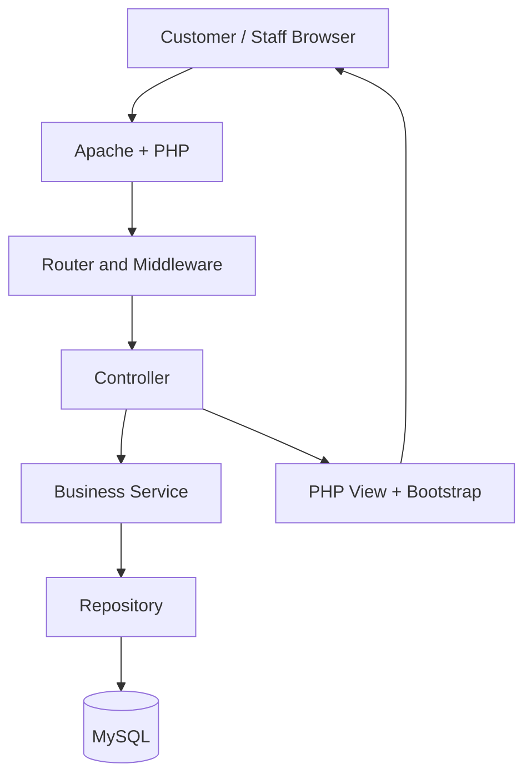

# System Architecture

## Architectural style

Healthy Bite uses a custom modular MVC structure, not a PHP framework. Controllers coordinate requests, services apply business rules, repositories perform database work, and views contain presentation markup.



## Layers

| Layer | Responsibility |
| --- | --- |
| Presentation | PHP views, Bootstrap components, vanilla JavaScript, accessible UI |
| Controller | Read route input, invoke services, select response/view |
| Service | Validation-independent business workflows and transactions |
| Repository | Prepared SQL statements and entity persistence |
| Middleware | Authentication, role permission, CSRF, QR-session checks |
| Infrastructure | Configuration, database connection, logging, file storage |

## Core request flows

### Owner menu management

Owner login -> authentication middleware -> controller -> menu service -> repository -> MySQL -> dashboard response.

### QR ordering

QR URL with opaque token -> token validation -> session regeneration and QR context session -> menu display -> cart -> order transaction -> staff queue.

The browser must never provide a trusted restaurant or table ID for ordering. The application reads that context only from the validated session.

## Recommended source layout

```text
app/Controllers/       Route handlers
app/Services/          Business workflows
app/Repositories/      MySQL access
app/Models/            Data objects
app/Middleware/        Access controls
app/Validation/        Reusable rules
app/Helpers/           Escaping, response, token helpers
config/                Environment-specific settings
public/                Entry point, assets, safe uploads, QR images
resources/views/       Layouts, components, role-specific views
routes/                Web routes
database/              Schema, seed data, migrations
docs/                  Project and college documentation
tests/                 Manual test evidence and automated tests when introduced
```

## Multi-tenant rule

Every restaurant-owned query includes the authenticated restaurant identifier obtained from the owner session. Repositories must not accept a restaurant ID directly from request data unless the service has already authorized it.
