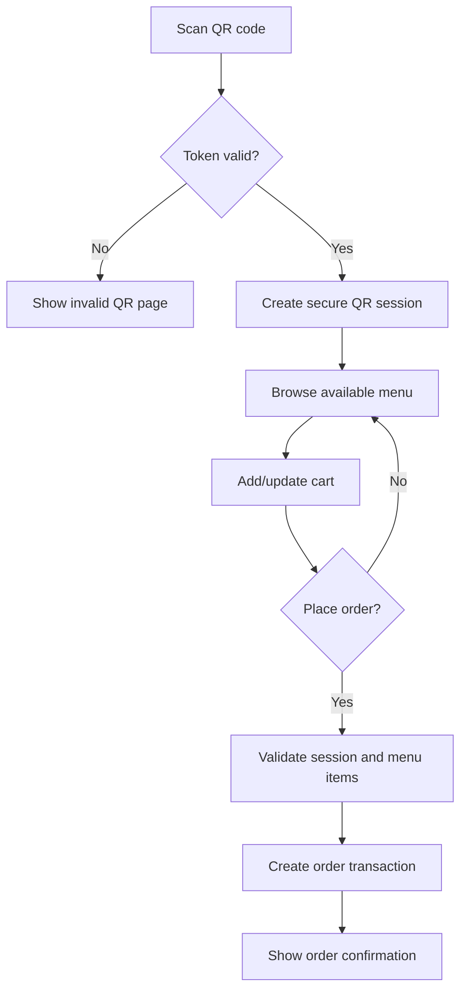
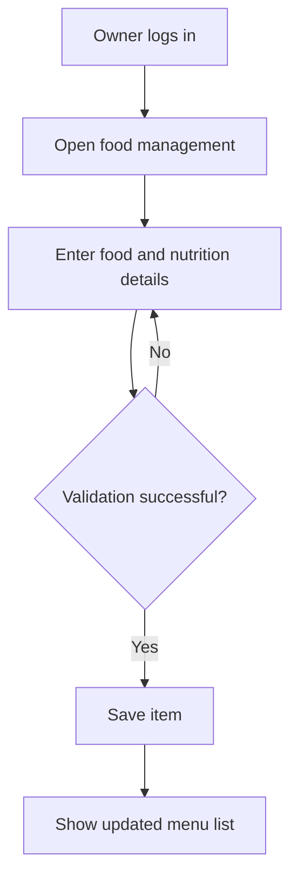

# Use Case and Activity Diagrams

## Primary actors

- Super administrator
- Restaurant owner
- Restaurant staff
- Customer

## Use cases

| Actor | Use cases |
| --- | --- |
| Super administrator | Approve/suspend restaurants, view platform records |
| Owner | Register/login, manage profile, menu, nutrition, tables, QR, staff, reports |
| Staff | Login, view assigned restaurant orders, change status |
| Customer | Scan QR, browse menu, view nutrition, manage cart, place order, view status |

## Customer ordering activity

## Owner menu-management activity

