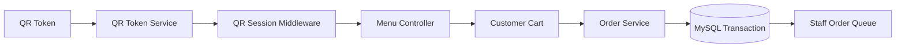
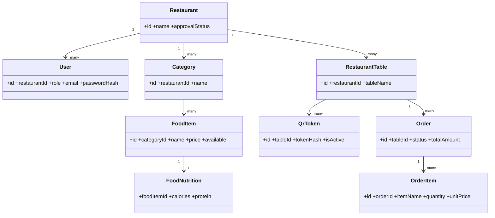

# Process Flow and Class Design

## Process flow: secure QR order

## Conceptual class diagram

## PHP responsibilities

Controllers receive requests; services validate workflow rules and transactions; repositories issue prepared queries; middleware enforces login, role, CSRF, and QR-session requirements; views render escaped information.
