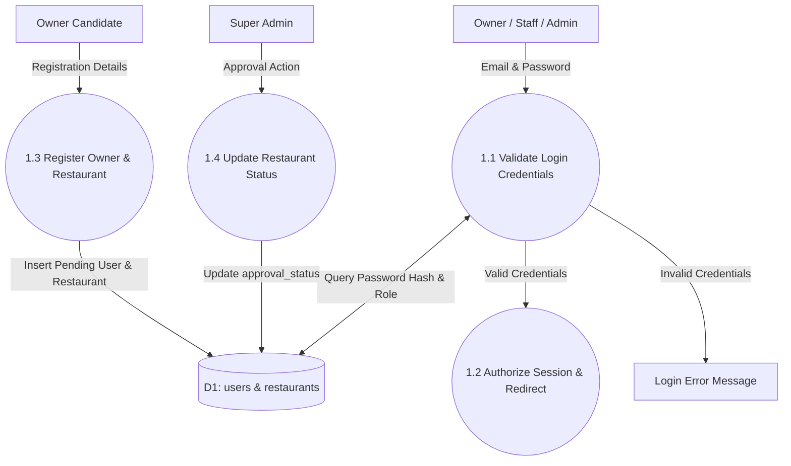
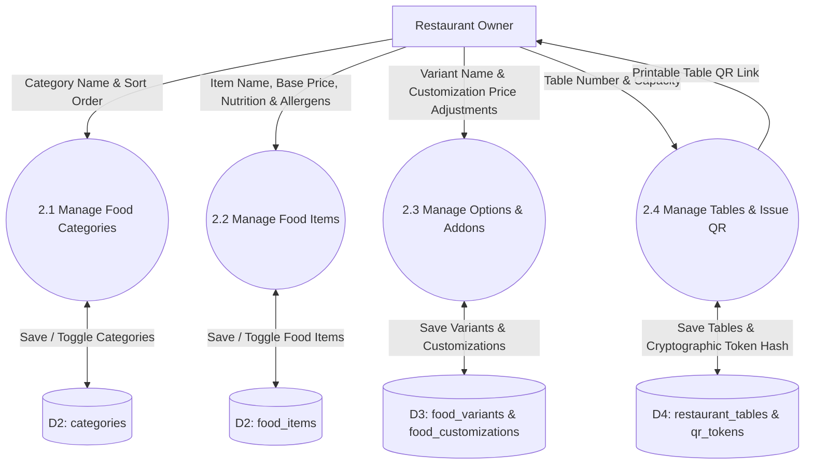
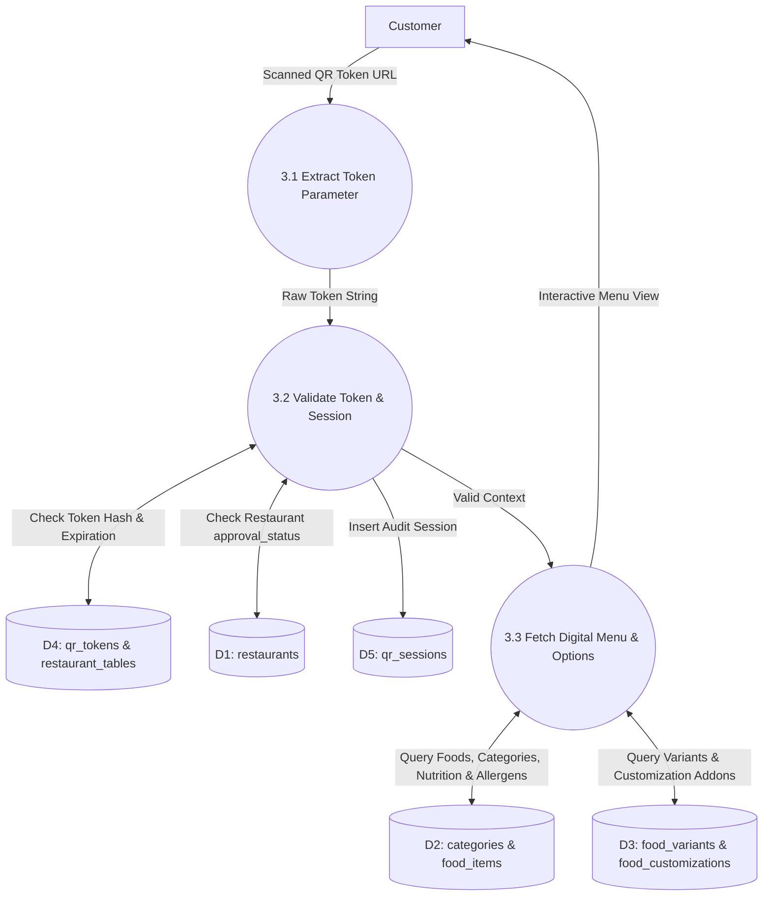
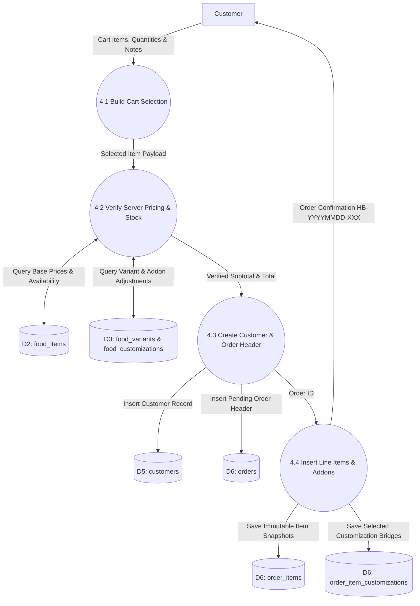
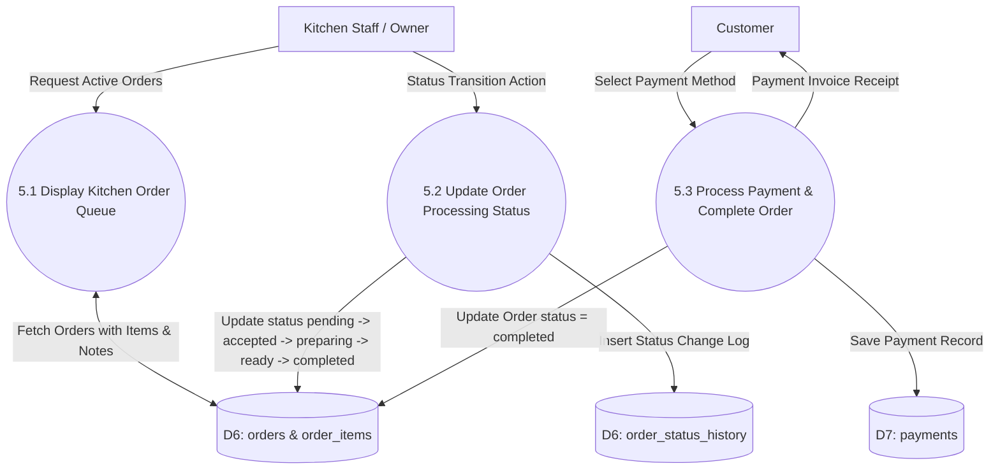
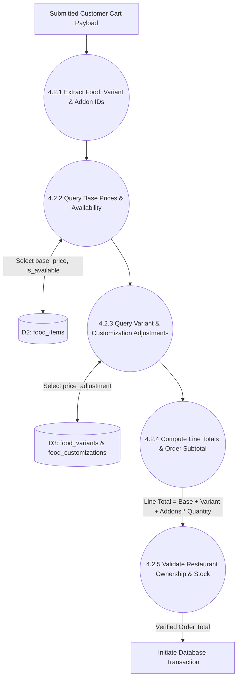

# Data Flow Diagrams (DFD) — Healthy Bite System

With the help of DFD, we designed the data flow and process structure of our system, which provides a comprehensive, academically strictly validated view of how data flows between users, system processes, and data stores.

## 4.2 DATAFLOW DIAGRAM

The Data flow diagram can be explained as separate levels indicating the individual complexity in each level of the system and gives a detailed explanation in the further levels that follow them.

### DFD Notation Standards & Components
- **External Entity (Rectangle)**: Actors interacting with Healthy Bite (`Customer`, `Restaurant Owner`, `Kitchen Staff`, `Super Admin`).
- **Process (Circle / Rounded Box)**: Data transformation functions (`1.0 Validate and Authenticate User`, `5.0 Validate Cart and Place Order`).
- **Data Store (Open Rectangle / Cylinder)**: Database tables (`D1 users & restaurants`, `D2 categories & food_items`, `D3 food_variants & food_customizations`, `D4 restaurant_tables & qr_tokens`, `D5 customers & qr_sessions`, `D6 orders & order_items`, `D7 payments`, `D8 reviews`).
- **Data Flow (Labeled Arrow)**: Directs movement of specific, labeled data items.

---

## Level 0 DFD (Context Diagram)

Initially in the first level of the Data flow, level 0 explains the basic outline of the system. The end-user sends data to the system to determine the source and destination address. The diagram marked as 0 represents the complete Healthy Bite system which simply represents the basic operation that is being performed by it in the initial level.

```mermaid
flowchart TD
    %% External Entities Top
    C[Customer]
    O[Restaurant Owner]

    %% Central Process
    HB(("0.0 Healthy Bite System"))

    %% External Entities Bottom
    S[Kitchen Staff]
    A[Super Admin]

    %% Customer Data Flows
    C -->|QR Code Token Link| HB
    C -->|Cart Items, Variants & Customizations| HB
    C -->|Customer Name & Phone Number| HB
    C -->|Payment Method & Details| HB
    C -->|Food Rating & Review Comment| HB
    
    HB -->|Interactive Food Menu & Nutrition Facts| C
    HB -->|Order Confirmation & Order Number| C
    HB -->|Real-time Order Status| C
    HB -->|Payment Receipt| C

    %% Restaurant Owner Data Flows
    O -->|Registration Details & Profile Updates| HB
    O -->|Owner Email & Password| HB
    O -->|Categories, Food Items & Base Prices| HB
    O -->|Variants, Customizations & Price Adjustments| HB
    O -->|Table Numbers & Capacity| HB
    O -->|Staff Account Details| HB

    HB -->|Registration Confirmation & Account Status| O
    HB -->|Table Cryptographic QR Codes| O
    HB -->|Live Kitchen Order Queue| O
    HB -->|Revenue & Sales Analytics Report| O
    HB -->|Customer Reviews Summary| O

    %% Staff Data Flows
    S -->|Staff Email & Password| HB
    S -->|Order Status Update| HB

    HB -->|Live Kitchen Order Queue| S
    HB -->|Status Update Acknowledgement| S

    %% Super Admin Data Flows
    A -->|Super Admin Credentials| HB
    A -->|Restaurant Approval / Suspension Action| HB

    HB -->|System Metrics & Restaurant List| A
    HB -->|Pending Restaurant Registrations| A
```

### Data Dictionary for Context Diagram

| Entity | Incoming Data Flow (To System) | Outgoing Data Flow (From System) |
| :--- | :--- | :--- |
| **Customer** | QR Token Link, Cart Items, Variants, Customizations, Customer Name, Phone Number, Payment Details, Food Rating & Review | Interactive Digital Menu, Nutrition Facts, Order Confirmation, Order Number, Real-time Order Status, Payment Receipt |
| **Restaurant Owner** | Registration Profile, Login Email, Password, Categories, Food Items, Base Prices, Variants, Customization Prices, Table Numbers, Staff Details | Cryptographic Table QR Codes, Live Kitchen Panel, Revenue Analytics Report, Customer Reviews Summary |
| **Kitchen Staff** | Staff Email & Password, Order Status Updates (`Accepted`, `Preparing`, `Ready`, `Served`) | Live Kitchen Order Queue, Status Update Acknowledgement |
| **Super Admin** | Super Admin Credentials, Restaurant Approval Action, Suspension Action | Platform Overview Metrics (Restaurants Count, Total Sales), Pending Registrations Queue |

---

## LEVEL 1 DFD: Main System Processes

The level 1 of the Data flow diagram explains in detail about the system which was marked as 0 in the previous level. In this level, the user request enters into the core processing modules and stores data into primary data stores.

```mermaid
flowchart TD
    %% External Entities
    C[Customer]
    O[Restaurant Owner]
    S[Kitchen Staff]
    A[Super Admin]

    %% Processes
    P1(("1.0 Validate and Authenticate User"))
    P2(("2.0 Manage Restaurant and Menu Catalog"))
    P3(("3.0 Manage Tables and Issue QR Tokens"))
    P4(("4.0 Scan QR Token and Navigate Menu"))
    P5(("5.0 Validate Cart and Place Order"))
    P6(("6.0 Process Kitchen Orders and Update Status"))
    P7(("7.0 Settle Payment and Generate Receipt"))
    P8(("8.0 Submit Reviews and Generate Reports"))

    %% Data Stores
    D1[("D1: users & restaurants")]
    D2[("D2: categories & food_items")]
    D3[("D3: food_variants & food_customizations")]
    D4[("D4: restaurant_tables & qr_tokens")]
    D5[("D5: customers & qr_sessions")]
    D6[("D6: orders & order_items")]
    D7[("D7: payments")]
    D8[("D8: reviews")]

    %% Process 1.0 Flows
    O -->|Owner Login & Profile Data| P1
    S -->|Staff Login Credentials| P1
    A -->|Admin Login & Approval Action| P1
    P1 <-->|Read / Write User Accounts & Approval Status| D1

    %% Process 2.0 Flows
    O -->|Categories, Food Items, Variants & Customizations| P2
    P2 <-->|Save Categories & Food Items| D2
    P2 <-->|Save Variants & Customization Prices| D3

    %% Process 3.0 Flows
    O -->|Table Number & Seating Capacity| P3
    P3 <-->|Save Tables & Cryptographic QR Tokens| D4
    P3 -->|Printable QR Codes| O

    %% Process 4.0 Flows
    C -->|Scanned QR Token Link| P4
    P4 <-->|Validate Token & Session Identifier| D4
    P4 <-->|Check Restaurant Approval Status| D1
    P4 -->|Save Customer QR Session| D5
    P4 <-->|Fetch Food Menu & Nutrition Facts| D2
    P4 <-->|Fetch Variants & Customizations| D3
    P4 -->|Interactive Digital Menu| C

    %% Process 5.0 Flows
    C -->|Cart Items, Customizations & Guest Details| P5
    P5 <-->|Verify Item Prices & Stock| D2
    P5 <-->|Verify Variant & Customization Costs| D3
    P5 -->|Save Customer Name & Phone| D5
    P5 -->|Save Pending Order & Line Items| D6
    P5 -->|Order Confirmation & Order Number| C

    %% Process 6.0 Flows
    S <-->|View Kitchen Queue & Update Status| P6
    O <-->|View Kitchen Queue & Update Status| P6
    P6 <-->|Fetch Active Orders & Record Status History| D6
    P6 -->|Real-time Order Status Updates| C

    %% Process 7.0 Flows
    C -->|Payment Method & Details| P7
    P7 <-->|Fetch Order Bill & Total Amount| D6
    P7 -->|Insert Payment Record| D7
    P7 -->|Update Order Status to Completed| D6
    P7 -->|Payment Receipt| C

    %% Process 8.0 Flows
    C -->|Rating & Feedback Comment| P8
    P8 -->|Insert Customer Review| D8
    P8 <-->|Fetch Completed Orders & Revenue| D6
    P8 -->|Sales Analytics & Customer Reviews| O
```

---

## LEVEL 2 DFDs: Sub-process Decomposition

### 2nd Level for 1.0: User Authentication & Registration

**Sub-process Summary (1.0):**
- **1.1 Validate Login Credentials**: Checks email format and password hash against `users` table.
- **1.2 Authorize Session & Redirect**: Creates session and routes user to Super Admin dashboard or Owner dashboard.
- **1.3 Register Owner & Restaurant**: Creates owner account and inserts restaurant record with `approval_status = 'pending'`.
- **1.4 Update Restaurant Status**: Super Admin approves or suspends restaurant accounts.

---

### 2nd Level for 2.0: Menu Catalog & Table QR Management

**Sub-process Summary (2.0):**
- **2.1 Manage Food Categories**: Creates/edits category names, sort order, and active flags.
- **2.2 Manage Food Items**: Manages food items, base prices, diet types (`veg`/`non-veg`), nutrition, and availability flags.
- **2.3 Manage Options & Addons**: Configures portion sizes/variants and extra toppings with price adjustments.
- **2.4 Manage Tables & Issue QR**: Generates 24-byte cryptographic table tokens, deactivates old tokens, and prints QR codes.

---

### 2nd Level for 3.0: Customer QR Session & Menu Navigation

**Sub-process Summary (3.0):**
- **3.1 Extract Token Parameter**: Captures customer scan request containing token string.
- **3.2 Validate Token & Session**: Checks token expiration, table active status, and restaurant approval.
- **3.3 Fetch Digital Menu & Options**: Renders food items, category tabs, dietary filters, nutrition info, and customization modal.

---

### 2nd Level for 4.0: Cart Validation & Order Placement

**Sub-process Summary (4.0):**
- **4.1 Build Cart Selection**: Customer selects items, quantities, sizes, extra toppings, special notes, name, and phone.
- **4.2 Verify Server Pricing & Stock**: Re-calculates item totals on the server (`base + variant + addons * qty`) to prevent tampering.
- **4.3 Create Customer & Order Header**: Creates guest record and inserts order header with status `pending`.
- **4.4 Insert Line Items & Addons**: Records immutable item snapshots and selected addons for historic invoice accuracy.

---

### 2nd Level for 5.0: Kitchen Order Processing & Payment Settlement

**Sub-process Summary (5.0):**
- **5.1 Display Kitchen Order Queue**: Shows live incoming orders for staff/owner kitchen display.
- **5.2 Update Order Processing Status**: Progresses order status through preparation stages.
- **5.3 Process Payment & Complete Order**: Handles Cash / Card / Online UPI payment, records payment status, and issues receipt.

---

## LEVEL 3 DFD: Detailed Breakdown of Critical Sub-Process

Level 3 provides a detailed breakdown of the most critical complex sub-process: **Server-Side Cart Calculation & Security Verification (4.2)**.

### 3rd Level for 4.2: Server-Side Cart Price Verification Workflow

**Level 3 Process Breakdown (4.2):**
1. **4.2.1 Extract Food, Variant & Addon IDs**: Extracts food IDs, quantities, variant IDs, and customization array from request.
2. **4.2.2 Query Base Prices & Availability**: Retrieves authoritative `base_price` and `is_available` flag from `food_items`.
3. **4.2.3 Query Variant & Customization Adjustments**: Queries price adjustments for selected size options and addon toppings.
4. **4.2.4 Compute Line Totals & Order Subtotal**: Calculates exact line subtotal `(base_price + variant_adjustment + addon_adjustments) * quantity`.
5. **4.2.5 Validate Restaurant Ownership & Stock**: Ensures items belong to scanned restaurant ID and are in stock before committing order transaction.

---

## System Data Store Dictionary

| Store ID | System Tables | Purpose & Key Contents |
| :--- | :--- | :--- |
| **D1** | `users`, `restaurants` | Account credentials, roles (`superadmin`, `owner`, `kitchen_staff`, `waiter_staff`), restaurant profiles, approval status (`pending`, `approved`, `suspended`) |
| **D2** | `categories`, `food_items` | Food categories, base prices, diet types (`veg`/`non-veg`), nutrition facts, ingredients, allergens, availability flags |
| **D3** | `food_variants`, `food_customizations` | Item size/portion variants and addon toppings with price adjustments |
| **D4** | `restaurant_tables`, `qr_tokens` | Dining table numbers, seating capacity, seating status, cryptographic token hashes, expiration timestamp |
| **D5** | `customers`, `qr_sessions` | Customer guest info (name, phone), QR session identifier, token ID, start time, last seen time |
| **D6** | `orders`, `order_items`, `order_item_customizations`, `order_status_history` | Order header (order number, subtotal, tax, total, status, notes), immutable line item snapshots, selected customization bridge records, status audit log |
| **D7** | `payments` | Payment method (`cash`, `card`, `upi`), transaction status |
| **D8** | `reviews` | Customer star ratings (1-5), feedback comments |
