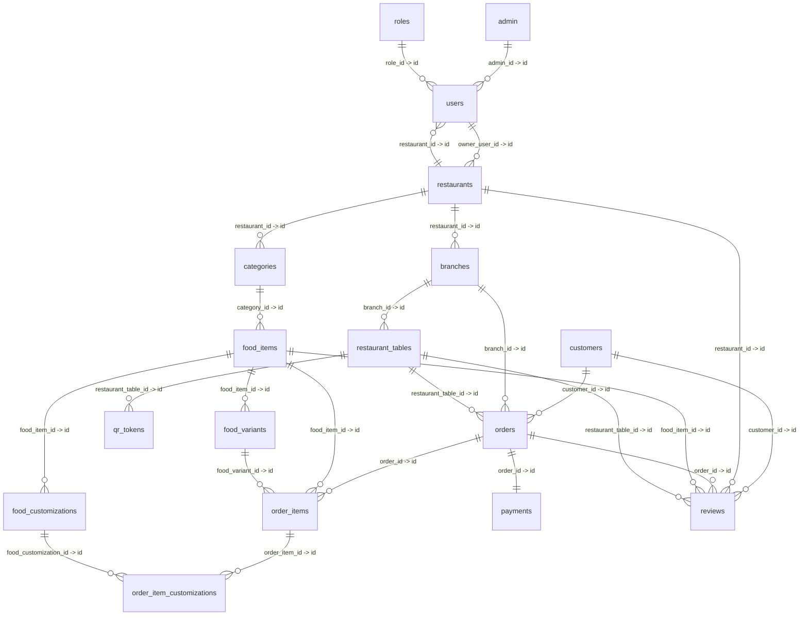

# 6.1 Database Relationship Summary

The **Healthy Bite – Digital Menu & Food Ordering System** database architecture is structured into 17 normalized relational tables in MySQL (InnoDB) supporting multi-tenancy, digital menu management, nutritional tracking, QR table seating, order lifecycle processing, payment reconciliation, and verified dining feedback.

---

## Logical Relationship Clusters

1. **Authentication & Identity Management:**
   - The `admin` and `roles` tables establish the authorization hierarchy, linking to `users` (1 : N).
   - Each `restaurant` is owned by an owner user (`users.id`) and employs operational staff members (`users.restaurant_id`).

2. **Multi-Tenant Branch & Seating Hierarchy:**
   - Each `restaurant` operates multiple physical `branches` (1 : N).
   - Each `branch` manages physical `restaurant_tables` (1 : N).
   - Each dining table generates dynamic, cryptographically secure `qr_tokens` (1 : N) for contactless menu ordering.

3. **Menu Catalog, Variants & Customizations:**
   - `restaurants` partition menus into `categories` (1 : N).
   - Each `category` contains multiple `food_items` (1 : N) storing nutritional macros (calories, protein, carbs, fat, fiber, sugar) and allergens.
   - Each `food_item` offers portion sizes in `food_variants` (1 : N) and optional add-ons in `food_customizations` (1 : N).

4. **Orders, Fulfillment & Payments:**
   - A `customer` seated at a `restaurant_table` in a `branch` places an `order` (1 : N).
   - An `order` contains multiple `order_items` (1 : N) capturing immutable price snapshots.
   - Selected extras are linked to ordered dishes via the associative bridge table `order_item_customizations` (M : N).
   - Each `order` is settled via a `payments` transaction (1 : 1).

5. **Customer Feedback & Review Integrity:**
   - Customers submit verified `reviews` associated with their `order`, specific `food_items`, dining `restaurant_table`, and parent `restaurant` (N : 1).

---

# 6.2 Database Implementation Summary

The Healthy Bite system is implemented using **MySQL 8.0+** with the **InnoDB** storage engine to guarantee full ACID compliance, foreign key enforcement, and crash recovery.

Key technical implementation details:
- **Primary Keys:** Every table uses a 64-bit integer (`BIGINT UNSIGNED AUTO_INCREMENT`) primary key (`id`) for high-performance indexing and horizontal scalability.
- **Referential Integrity:** Enforces 25 active foreign keys with explicit cascading rules (`ON UPDATE CASCADE`, `ON DELETE CASCADE / RESTRICT / SET NULL`) to maintain referential integrity without orphan records.
- **Precision Financials:** Money attributes (`base_price`, `unit_price`, `subtotal`, `tax_amount`, `total_amount`, `amount`) use `DECIMAL(10,2)` to prevent floating-point calculation errors.
- **Universal Character Encoding:** Universal `utf8mb4` encoding with `utf8mb4_unicode_ci` collation ensures multilingual support and emoji compatibility.
